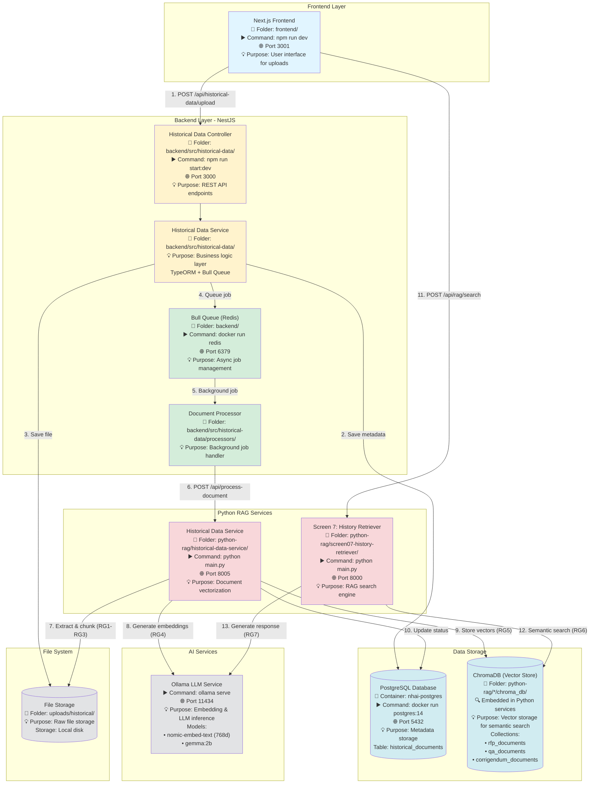
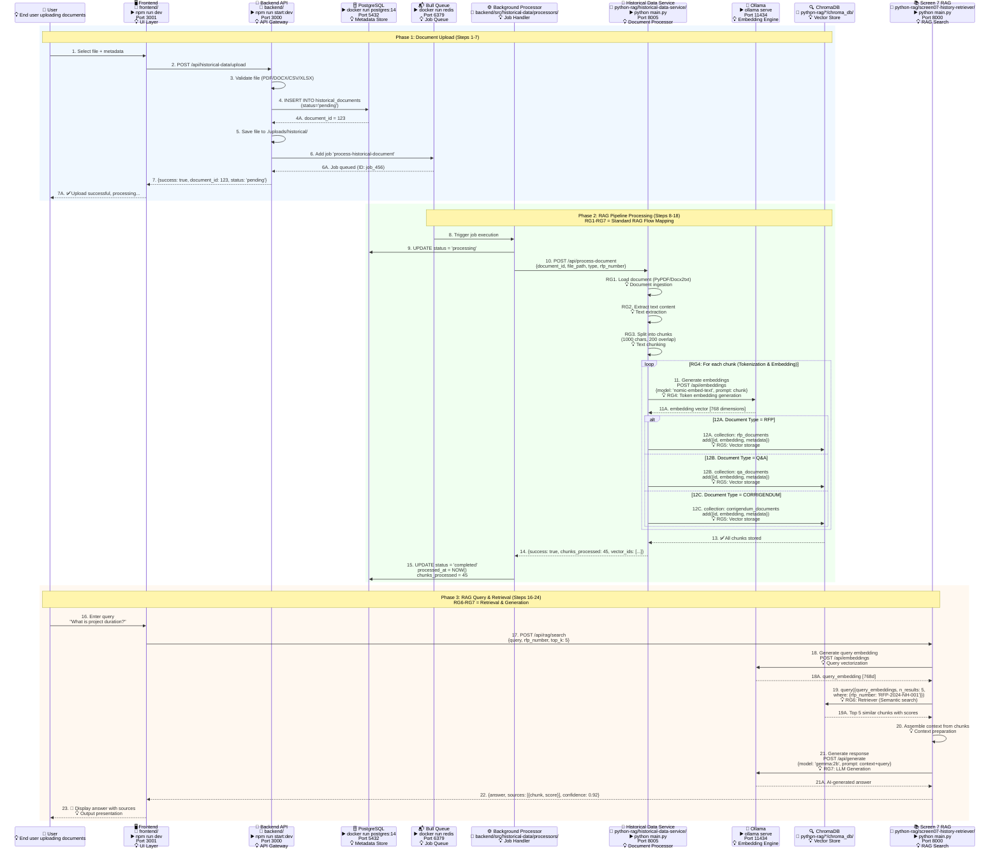
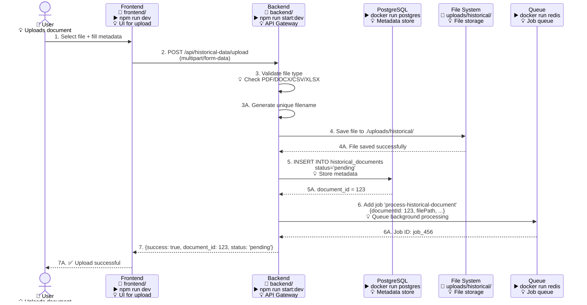
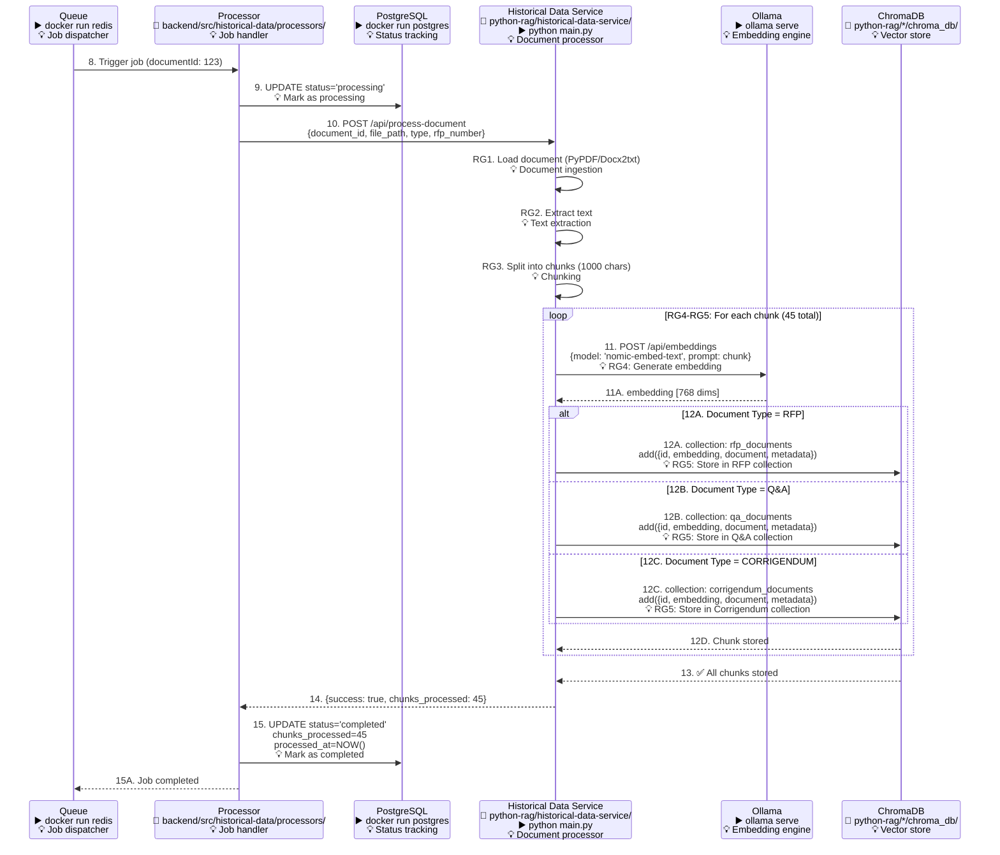
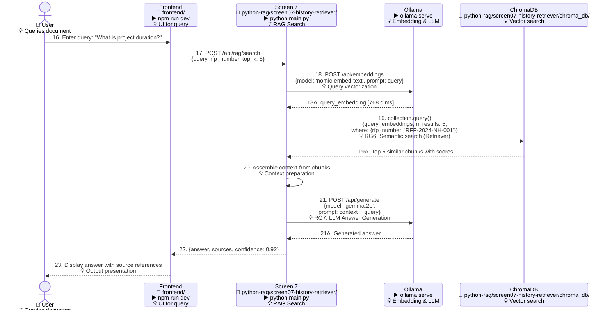

# Screen 7: Historical Data Upload System - Complete Data Flow (V3)

**Document:** Screen 7 Data Flow Architecture with Numbered Sequences & RAG Flow Mapping  
**Date:** January 27, 2026  
**Version:** 3.0  
**Status:** ✅ Production Ready  
**Updates V3:** 
- ✅ Added numbered sequences to all flow arrows (1, 2, 3, 2A, 2B for forks)
- ✅ Added RAG-specific numbering (RG1-RG7) mapping to standard RAG pipeline
- ✅ Added one-liner purpose descriptions for each component/class

---

## Table of Contents

1. [System Overview](#system-overview)
2. [Service Startup Commands](#service-startup-commands)
3. [Architecture Components with Commands](#architecture-components-with-commands)
4. [Enhanced Data Flow Diagram with Numbered Sequences](#enhanced-data-flow-diagram-with-numbered-sequences)
5. [API Endpoints](#api-endpoints)
6. [PostgreSQL Database Schema](#postgresql-database-schema)
7. [Vector Database (ChromaDB)](#vector-database-chromadb)
8. [Embedding Process with RAG Flow Mapping](#embedding-process-with-rag-flow-mapping)
9. [Data Flow Sequences](#data-flow-sequences)
10. [Background Processing](#background-processing)
11. [Error Handling & Retry](#error-handling--retry)

---

## System Overview

**Screen 7** (Historical Data Upload & Retrieval) manages the complete lifecycle of historical RFP documents, Q&A pairs, and corrigendums. The system provides:

- **Document Upload:** Multi-format file upload (PDF, DOCX, CSV, XLSX)
- **Metadata Storage:** PostgreSQL for structured data
- **Vector Storage:** ChromaDB for semantic search
- **Background Processing:** Bull queue for async document processing
- **RAG Integration:** Python services for document chunking and embedding
- **Query Interface:** Semantic search across historical documents

### Key Services with Startup Commands

| Service | Port | Folder | Startup Command | Technology | Purpose |
|---------|------|--------|-----------------|------------|---------|
| Backend (NestJS) | 3000 | `backend/` | `npm run start:dev` | Node.js + TypeScript | Main API gateway and orchestrator |
| Frontend (Next.js) | 3001 | `frontend/` | `npm run dev` | React + Next.js | User interface for document upload |
| Screen 7 (History Retriever) | 8000 | `python-rag/screen07-history-retriever/` | `python main.py` | Python + FastAPI | RAG-based search and retrieval |
| Historical Data Service | 8005 | `python-rag/historical-data-service/` | `python main.py` | Python + FastAPI | Document processing & vectorization |
| PostgreSQL | 5432 | N/A | Docker container | PostgreSQL 14 | Metadata and document status storage |
| Redis (Bull Queue) | 6379 | N/A | `docker run redis` | Redis | Background job queue manager |
| Ollama | 11434 | N/A | `ollama serve` | LLM Service | Embedding generation & LLM inference |
| ChromaDB | N/A | `python-rag/*/chroma_db/` | Embedded in services | Vector DB | Vector storage for semantic search |

---

## Service Startup Commands

### 1. Start PostgreSQL Database
```bash
# Using Docker
# Purpose: Stores document metadata and processing status
docker run -d \
  --name nhai-postgres \
  -e POSTGRES_PASSWORD=your_password \
  -e POSTGRES_DB=nhai_tender_db \
  -p 5432:5432 \
  postgres:14
```

### 2. Start Redis (for Bull Queue)
```bash
# Using Docker
# Purpose: Manages background job queue for async processing
docker run -d \
  --name nhai-redis \
  -p 6379:6379 \
  redis:latest
```
**Folder:** Backend manages connection  
**Used by:** `backend/` for Bull Queue

### 3. Start Ollama Service
```bash
# Start Ollama
# Purpose: Generates embeddings and provides LLM inference
ollama serve
```
**Port:** 11434  
**Models Required:**
```bash
ollama pull nomic-embed-text  # For embeddings (768 dimensions)
ollama pull gemma:2b           # For text generation
```

### 4. Start Backend (NestJS)
```bash
# Purpose: Main API gateway for frontend communication
cd backend/
npm run start:dev
```
**Port:** 3000  
**Folder:** `backend/`  
**Script:** Defined in `package.json`

### 5. Start Frontend (Next.js)
```bash
# Purpose: User interface for document upload and query
cd frontend/
npm run dev
```
**Port:** 3001  
**Folder:** `frontend/`  
**Script:** Defined in `package.json`

### 6. Start Historical Data Service
```bash
# Purpose: Document extraction, chunking, and vectorization
cd python-rag/historical-data-service/
python main.py
```
**Port:** 8005  
**Folder:** `python-rag/historical-data-service/`  
**Virtual Env:** `nhai-venv/`

### 7. Start Screen 7 - History Retriever
```bash
# Purpose: RAG-based semantic search and answer generation
cd python-rag/screen07-history-retriever/
python main.py
```
**Port:** 8000  
**Folder:** `python-rag/screen07-history-retriever/`  
**Virtual Env:** `nhai-venv/`

---

## Architecture Components with Commands



---

## Enhanced Data Flow Diagram with Numbered Sequences

### Complete Upload to Query Flow with Numbered Sequences



**RAG Flow Mapping Legend:**
- **RG1 (Document Ingestion):** Load source document from file system
- **RG2 (Text Extraction):** Extract raw text from PDF/DOCX/CSV
- **RG3 (Chunking):** Split text into overlapping chunks (1000 chars, 200 overlap)
- **RG4 (Embedding):** Convert each chunk to 768-dimension vector using Ollama
- **RG5 (Vector Storage):** Store embeddings in ChromaDB with metadata
- **RG6 (Retriever):** Semantic search to find relevant chunks for query
- **RG7 (LLM Generation):** Generate answer using retrieved context + LLM

---

## Service Folder Structure

```
NHAI-TENDER-AUTOMATION/
│
├── backend/                                    # Backend Service (Port 3000)
│   │                                           # Purpose: Main API gateway
│   ├── src/
│   │   ├── historical-data/                   # Historical data module
│   │   │   │                                   # Purpose: Document lifecycle management
│   │   │   ├── historical-data.controller.ts  # API endpoints (7 routes)
│   │   │   ├── historical-data.service.ts     # Business logic layer
│   │   │   ├── historical-data.module.ts      # Module definition
│   │   │   ├── entities/
│   │   │   │   └── historical-document.entity.ts  # TypeORM entity
│   │   │   ├── dto/
│   │   │   │   ├── upload-historical-data.dto.ts  # Upload validation
│   │   │   │   └── query-document.dto.ts          # Query validation
│   │   │   └── processors/
│   │   │       └── document-processing-rag.processor.ts  # Background job handler
│   │   └── main.ts
│   ├── package.json                           # Dependencies
│   └── .env                                   # Environment config
│
├── frontend/                                   # Frontend Service (Port 3001)
│   │                                           # Purpose: User interface
│   ├── app/
│   │   └── screen7/                           # Screen 7 pages
│   ├── components/
│   ├── services/
│   │   └── historicalDataService.ts           # API client
│   └── package.json
│
├── python-rag/
│   ├── historical-data-service/               # Port 8005
│   │   │                                       # Purpose: Document processing & vectorization
│   │   ├── main.py                            # FastAPI server (3 endpoints)
│   │   ├── chroma_db/                         # ChromaDB storage
│   │   ├── requirements.txt
│   │   └── .env
│   │
│   └── screen07-history-retriever/            # Port 8000
│       │                                       # Purpose: RAG-based search
│       ├── main.py                            # FastAPI server (5 endpoints)
│       ├── chroma_db/                         # ChromaDB storage
│       ├── requirements.txt
│       └── .env
│
├── uploads/
│   └── historical/                            # Document storage
│       │                                       # Purpose: Raw file storage
│       ├── rfp_documents/
│       ├── qa_documents/
│       └── corrigendum_documents/
│
└── nhai-venv/                                 # Python virtual environment
    │                                           # Purpose: Python dependencies isolation
    └── Scripts/
        └── activate.bat
```

---

## API Endpoints

### Backend (NestJS) - Port 3000

**Base URL:** `http://localhost:3000`  
**Folder:** `backend/src/historical-data/`  
**File:** `historical-data.controller.ts`

#### 1. Upload Historical Document

**Endpoint:** `POST /api/historical-data/upload`  
**Purpose:** Upload document file with metadata, initiate processing pipeline  
**Controller Method:** `uploadDocument()`

**Request:**
- **Type:** `multipart/form-data`
- **File Field:** `file` (PDF, DOCX, CSV, XLSX)
- **Form Fields:**
  - `rfp_number`: string (required) - RFP reference number
  - `title`: string (required) - Document title
  - `document_type`: enum (required) - 'RFP' | 'Q&A' | 'CORRIGENDUM'
  - `description`: string (optional) - Document description

**Response:**
```json
{
  "success": true,
  "data": {
    "id": 123,
    "file_name": "rfp_document.pdf",
    "document_type": "RFP",
    "rfp_number": "RFP-2024-NH-001",
    "title": "Mumbai-Pune Expressway",
    "status": "pending",
    "uploaded_at": "2026-01-27T10:00:00Z"
  },
  "message": "Document uploaded successfully and queued for processing"
}
```

**Processing Flow:**
1. Validate file type and size
2. Save file to `uploads/historical/`
3. Create record in PostgreSQL (status: 'pending')
4. Queue background job in Bull/Redis
5. Return document metadata to frontend

---

#### 2. Get All Documents

**Endpoint:** `GET /api/historical-data`  
**Purpose:** Retrieve paginated list of all historical documents with filtering  
**Controller Method:** `getAllDocuments()`

**Query Parameters:**
- `page`: number (default: 1) - Page number
- `pageSize`: number (default: 10) - Items per page
- `document_type`: string (optional) - Filter by type ('RFP', 'Q&A', 'CORRIGENDUM')
- `status`: string (optional) - Filter by status ('pending', 'processing', 'completed', 'failed')
- `rfp_number`: string (optional) - Filter by RFP number
- `search`: string (optional) - Search in title/description

**Response:**
```json
{
  "success": true,
  "data": [
    {
      "id": 123,
      "file_name": "rfp_document.pdf",
      "document_type": "RFP",
      "rfp_number": "RFP-2024-NH-001",
      "title": "Mumbai-Pune Expressway",
      "description": "Historical RFP for reference",
      "file_path": "uploads/historical/rfp_document_1737976800000.pdf",
      "file_size": 2457600,
      "status": "completed",
      "uploaded_at": "2026-01-27T10:00:00Z",
      "processed_at": "2026-01-27T10:02:30Z",
      "chunks_processed": 45,
      "error_message": null
    }
  ],
  "pagination": {
    "total": 150,
    "page": 1,
    "pageSize": 10,
    "totalPages": 15
  }
}
```

---

#### 3. Get Document by ID

**Endpoint:** `GET /api/historical-data/:id`  
**Purpose:** Retrieve complete details of a specific document  
**Controller Method:** `getDocumentById()`

**Path Parameters:**
- `id`: number (required) - Document ID

**Response:**
```json
{
  "success": true,
  "data": {
    "id": 123,
    "file_name": "rfp_document.pdf",
    "document_type": "RFP",
    "rfp_number": "RFP-2024-NH-001",
    "title": "Mumbai-Pune Expressway Development",
    "description": "Complete RFP documentation",
    "file_path": "uploads/historical/rfp_document_1737976800000.pdf",
    "file_size": 2457600,
    "status": "completed",
    "uploaded_at": "2026-01-27T10:00:00Z",
    "processed_at": "2026-01-27T10:02:30Z",
    "chunks_processed": 45,
    "processing_metadata": {
      "embedding_provider": "ollama",
      "embedding_model": "nomic-embed-text",
      "processing_time": 150.5,
      "vector_ids": ["doc_123_chunk_0", "doc_123_chunk_1", "..."]
    },
    "error_message": null
  }
}
```

---

#### 4. Get Statistics Summary

**Endpoint:** `GET /api/historical-data/stats/summary`  
**Purpose:** Retrieve aggregate statistics for all documents  
**Controller Method:** `getStatistics()`

**Response:**
```json
{
  "success": true,
  "data": {
    "total_documents": 150,
    "by_status": {
      "pending": 5,
      "processing": 2,
      "completed": 138,
      "failed": 5
    },
    "by_type": {
      "RFP": 80,
      "Q&A": 50,
      "CORRIGENDUM": 20
    },
    "total_chunks_processed": 6750,
    "total_file_size": 368640000,
    "average_chunks_per_document": 45,
    "recent_uploads": [
      {
        "id": 150,
        "title": "Latest RFP",
        "uploaded_at": "2026-01-27T10:00:00Z"
      }
    ]
  }
}
```

---

#### 5. Retry Failed Document Processing

**Endpoint:** `POST /api/historical-data/:id/retry`  
**Purpose:** Manually retry processing for failed documents  
**Controller Method:** `retryProcessing()`

**Path Parameters:**
- `id`: number (required) - Document ID

**Response:**
```json
{
  "success": true,
  "message": "Document queued for reprocessing",
  "data": {
    "id": 123,
    "status": "pending",
    "retry_count": 1
  }
}
```

**Process:**
1. Check if document status is 'failed'
2. Reset status to 'pending'
3. Clear error message
4. Re-queue job in Bull
5. Return updated status

---

#### 6. Query Document

**Endpoint:** `POST /api/historical-data/:id/query`  
**Purpose:** Query specific document using natural language  
**Controller Method:** `queryDocument()`

**Path Parameters:**
- `id`: number (required) - Document ID

**Request Body:**
```json
{
  "question": "What is the project duration?"
}
```

**Response:**
```json
{
  "success": true,
  "data": {
    "document_id": 123,
    "question": "What is the project duration?",
    "answer": "The project duration is 24 months from the date of contract signing, as specified in Section 3.2 of the RFP document.",
    "sources": [
      {
        "content": "Project Timeline: The successful bidder shall complete the project within 24 months from the date of contract signing...",
        "metadata": {
          "chunk_index": 12,
          "rfp_number": "RFP-2024-NH-001"
        },
        "similarity": 0.92
      }
    ],
    "confidence": 0.92,
    "processing_time": 2.3
  }
}
```

**Process:**
1. Call Historical Data Service: `POST /api/query-document`
2. Service queries ChromaDB for relevant chunks
3. Uses Ollama to generate answer
4. Returns answer with source citations

---

#### 7. Delete Document

**Endpoint:** `DELETE /api/historical-data/:id`  
**Purpose:** Delete document and all associated vectors  
**Controller Method:** `deleteDocument()`

**Path Parameters:**
- `id`: number (required) - Document ID

**Response:**
```json
{
  "success": true,
  "message": "Document deleted successfully",
  "data": {
    "id": 123,
    "vectors_deleted": 45,
    "file_deleted": true
  }
}
```

**Process:**
1. Delete file from `uploads/historical/`
2. Call Historical Data Service to delete vectors from ChromaDB
3. Delete record from PostgreSQL
4. Return deletion confirmation

---

### Historical Data Service (Python) - Port 8005

**Base URL:** `http://localhost:8005`  
**Folder:** `python-rag/historical-data-service/`  
**File:** `main.py`  
**Purpose:** Document processing, chunking, embedding generation, and vector storage

#### 1. Process Document

**Endpoint:** `POST /api/process-document`  
**Purpose:** Extract text, chunk, generate embeddings, and store in ChromaDB  
**Function:** `process_document()`

**Request Body:**
```json
{
  "document_id": 123,
  "file_path": "./uploads/historical/rfp_document.pdf",
  "file_name": "rfp_document.pdf",
  "document_type": "RFP",
  "rfp_number": "RFP-2024-NH-001",
  "title": "Mumbai-Pune Expressway"
}
```

**Response:**
```json
{
  "success": true,
  "document_id": 123,
  "chunks_processed": 45,
  "vector_ids": [
    "doc_123_chunk_0",
    "doc_123_chunk_1",
    "..."
  ],
  "extracted_content": "Full extracted text...",
  "processing_time": 32.5,
  "embedding_provider": "ollama",
  "message": "Document processed successfully"
}
```

**Processing Steps (RAG Pipeline):**
1. **RG1:** Load document (PyPDFLoader, Docx2txtLoader, CSVLoader)
2. **RG2:** Extract text content
3. **RG3:** Split into chunks (RecursiveCharacterTextSplitter: 1000 chars, 200 overlap)
4. **RG4:** Generate embeddings (Ollama `nomic-embed-text`: 768 dimensions)
5. **RG5:** Store in ChromaDB with metadata (collection based on document_type)

---

#### 2. Query Document

**Endpoint:** `POST /api/query-document`  
**Purpose:** Query specific document using semantic search and LLM  
**Function:** `query_document()`

**Request Body:**
```json
{
  "document_id": 123,
  "question": "What is the project duration?",
  "document_type": "RFP",
  "rfp_number": "RFP-2024-NH-001"
}
```

**Response:**
```json
{
  "success": true,
  "document_id": 123,
  "question": "What is the project duration?",
  "answer": "The project duration is 24 months from contract signing.",
  "sources": [
    {
      "content": "Project Timeline: 24 months...",
      "metadata": {"chunk_index": 12},
      "similarity": 0.92
    }
  ],
  "embedding_provider": "ollama",
  "processing_time": 2.3
}
```

**Process (RAG Retrieval):**
1. **RG6:** Semantic search in ChromaDB to find relevant chunks
2. **RG7:** Generate answer using Ollama LLM with retrieved context

---

#### 3. Delete Document Vectors

**Endpoint:** `DELETE /api/delete-document/:id`  
**Purpose:** Delete all vectors associated with a document from ChromaDB  
**Function:** `delete_document()`

**Response:**
```json
{
  "success": true,
  "document_id": 123,
  "vectors_deleted": 45,
  "message": "All vectors deleted from ChromaDB"
}
```

---

### Screen 7 (History Retriever) - Port 8000

**Base URL:** `http://localhost:8000`  
**Folder:** `python-rag/screen07-history-retriever/`  
**File:** `main.py`  
**Purpose:** RAG-based semantic search across all historical documents

#### 1. Health Check

**Endpoint:** `GET /api/health`  
**Purpose:** Check service health and configuration  
**Function:** `health_check()`

**Response:**
```json
{
  "status": "healthy",
  "service": "NHAI History Retriever Agent",
  "version": "1.0.0",
  "timestamp": "2026-01-27T10:00:00Z",
  "vector_store": "chromadb",
  "embedding_provider": "ollama",
  "llm_provider": "ollama"
}
```

---

#### 2. Ingest Document

**Endpoint:** `POST /api/ingest`  
**Purpose:** Directly ingest document into Screen 7's ChromaDB instance  
**Function:** `ingest_document()`

**Request Body:**
```json
{
  "document_id": "doc_123",
  "document_type": "rfp",
  "file_path": "./uploads/historical/document.pdf",
  "file_name": "document.pdf",
  "rfp_number": "RFP-2024-NH-001",
  "title": "Mumbai-Pune Expressway",
  "metadata": {
    "description": "Historical RFP for reference"
  }
}
```

**Response:**
```json
{
  "success": true,
  "document_id": "doc_123",
  "chunks_processed": 45,
  "vector_store_id": "nhai_historical_data",
  "processing_time": 28.5,
  "message": "Document ingested and vectorized successfully"
}
```

---

#### 3. Semantic Search (Main RAG Endpoint)

**Endpoint:** `POST /api/rag/search`  
**Purpose:** Perform semantic search across all historical documents using RAG  
**Function:** `rag_search()`

**Request Body:**
```json
{
  "query": "What is the project duration?",
  "top_k": 5,
  "document_type": "rfp",
  "rfp_number": "RFP-2024-NH-001",
  "filter": {
    "document_type": "rfp"
  }
}
```

**Response:**
```json
{
  "success": true,
  "query": "What is the project duration?",
  "results": [
    {
      "document_id": "doc_123",
      "chunk_id": "doc_123_chunk_12",
      "content": "Project Timeline: The successful bidder shall complete the project within 24 months from the date of contract signing...",
      "score": 0.92,
      "metadata": {
        "rfp_number": "RFP-2024-NH-001",
        "document_type": "rfp",
        "chunk_index": 12,
        "title": "Mumbai-Pune Expressway"
      }
    },
    {
      "document_id": "doc_123",
      "chunk_id": "doc_123_chunk_15",
      "content": "Section 3.2 - Project Duration and Milestones: Phase 1 (Months 1-12)...",
      "score": 0.87,
      "metadata": {
        "rfp_number": "RFP-2024-NH-001",
        "chunk_index": 15
      }
    }
  ],
  "execution_time": 0.85,
  "total_results": 5
}
```

**RAG Process:**
1. **Query Embedding:** Convert query to 768d vector using Ollama
2. **RG6 - Retrieval:** Semantic search in ChromaDB collections
3. **RG7 - Generation:** Optional LLM answer generation (if requested)
4. **Ranking:** Sort results by similarity score
5. **Return:** Top-k results with source metadata

---

#### 4. Get Configuration

**Endpoint:** `GET /api/config`  
**Purpose:** Retrieve current RAG configuration  
**Function:** `get_config()`

**Response:**
```json
{
  "embedding_provider": "ollama",
  "embedding_model": "nomic-embed-text",
  "llm_provider": "ollama",
  "llm_model": "gemma:2b",
  "vector_store": "chromadb",
  "chunk_size": 1000,
  "chunk_overlap": 200,
  "top_k": 5,
  "collections": ["rfp_documents", "qa_documents", "corrigendum_documents"]
}
```

---

#### 5. Get Statistics

**Endpoint:** `GET /api/statistics`  
**Purpose:** Retrieve vector store statistics  
**Function:** `get_statistics()`

**Response:**
```json
{
  "success": true,
  "collections": {
    "rfp_documents": {
      "count": 3600,
      "documents": 80
    },
    "qa_documents": {
      "count": 2250,
      "documents": 50
    },
    "corrigendum_documents": {
      "count": 900,
      "documents": 20
    }
  },
  "total_vectors": 6750,
  "total_documents": 150
}
```

---

## PostgreSQL Database Schema

### Table: `historical_documents`

**Purpose:** Store document metadata and processing status  
**Database:** `nhai_tender_db`  
**Schema:** `public`

**Columns:**

| Column | Type | Nullable | Default | Purpose |
|--------|------|----------|---------|---------|
| `id` | SERIAL | NO | AUTO | Primary key |
| `file_name` | VARCHAR(255) | NO | - | Original filename |
| `file_path` | TEXT | NO | - | Storage path |
| `file_size` | BIGINT | YES | NULL | File size in bytes |
| `document_type` | VARCHAR(50) | NO | - | RFP/Q&A/CORRIGENDUM |
| `rfp_number` | VARCHAR(100) | NO | - | RFP reference |
| `title` | VARCHAR(500) | NO | - | Document title |
| `description` | TEXT | YES | NULL | Document description |
| `status` | VARCHAR(50) | NO | 'pending' | pending/processing/completed/failed |
| `uploaded_at` | TIMESTAMP | NO | NOW() | Upload timestamp |
| `processed_at` | TIMESTAMP | YES | NULL | Processing completion time |
| `chunks_processed` | INTEGER | YES | NULL | Number of chunks vectorized |
| `processing_metadata` | JSONB | YES | NULL | Processing details |
| `error_message` | TEXT | YES | NULL | Error details if failed |
| `created_at` | TIMESTAMP | NO | NOW() | Record creation time |
| `updated_at` | TIMESTAMP | NO | NOW() | Last update time |

**Indexes:**

1. `idx_historical_rfp_number` - Index on `rfp_number` for fast RFP lookup
2. `idx_historical_status` - Index on `status` for filtering
3. `idx_historical_type` - Index on `document_type` for filtering
4. `idx_historical_uploaded` - Index on `uploaded_at` for sorting
5. `idx_historical_rfp_status` - Composite index on `(rfp_number, status)` for common queries

**Constraints:**

- `PK_historical_documents` - Primary key on `id`
- `CHK_status` - Check status IN ('pending', 'processing', 'completed', 'failed')
- `CHK_document_type` - Check document_type IN ('RFP', 'Q&A', 'CORRIGENDUM')

**TypeORM Entity:**

**File:** `backend/src/historical-data/entities/historical-document.entity.ts`  
**Purpose:** ORM mapping for historical_documents table

```typescript
@Entity('historical_documents')
export class HistoricalDocument {
  @PrimaryGeneratedColumn()
  id: number;

  @Column({ name: 'file_name', length: 255 })
  fileName: string;

  @Column({ name: 'file_path', type: 'text' })
  filePath: string;

  @Column({ name: 'file_size', type: 'bigint', nullable: true })
  fileSize: number;

  @Column({ name: 'document_type', length: 50 })
  documentType: 'RFP' | 'Q&A' | 'CORRIGENDUM';

  @Column({ name: 'rfp_number', length: 100 })
  rfpNumber: string;

  @Column({ length: 500 })
  title: string;

  @Column({ type: 'text', nullable: true })
  description: string;

  @Column({ length: 50, default: 'pending' })
  status: 'pending' | 'processing' | 'completed' | 'failed';

  @Column({ name: 'uploaded_at', type: 'timestamp', default: () => 'NOW()' })
  uploadedAt: Date;

  @Column({ name: 'processed_at', type: 'timestamp', nullable: true })
  processedAt: Date;

  @Column({ name: 'chunks_processed', type: 'integer', nullable: true })
  chunksProcessed: number;

  @Column({ name: 'processing_metadata', type: 'jsonb', nullable: true })
  processingMetadata: any;

  @Column({ name: 'error_message', type: 'text', nullable: true })
  errorMessage: string;

  @CreateDateColumn({ name: 'created_at' })
  createdAt: Date;

  @UpdateDateColumn({ name: 'updated_at' })
  updatedAt: Date;
}
```

**Example Records:**

```sql
-- Completed RFP Document
INSERT INTO historical_documents VALUES (
  123,
  'rfp_document.pdf',
  'uploads/historical/rfp_document_1737976800000.pdf',
  2457600,
  'RFP',
  'RFP-2024-NH-001',
  'Mumbai-Pune Expressway Development',
  'Complete RFP documentation for highway project',
  'completed',
  '2026-01-27 10:00:00',
  '2026-01-27 10:02:30',
  45,
  '{"embedding_provider": "ollama", "processing_time": 150.5}',
  NULL,
  '2026-01-27 10:00:00',
  '2026-01-27 10:02:30'
);

-- Failed Q&A Document
INSERT INTO historical_documents VALUES (
  124,
  'qa_document.docx',
  'uploads/historical/qa_document_1737977000000.docx',
  1048576,
  'Q&A',
  'RFP-2024-NH-001',
  'Pre-bid Meeting Q&A',
  'Questions and answers from pre-bid meeting',
  'failed',
  '2026-01-27 10:05:00',
  NULL,
  0,
  NULL,
  'Failed to connect to Ollama service: Connection refused',
  '2026-01-27 10:05:00',
  '2026-01-27 10:05:30'
);
```

---

## Vector Database (ChromaDB)

### Collections Overview

**Purpose:** Store document embeddings for semantic search  
**Storage:** Embedded in Python services  
**Folders:** `python-rag/*/chroma_db/`  
**Dimensions:** 768 (Ollama nomic-embed-text)

### Collection 1: `rfp_documents`

**Purpose:** Store RFP document chunks and embeddings  
**Estimated Size:** ~80 documents, ~3600 chunks (avg 45 chunks/doc)

**Metadata Schema:**
```json
{
  "document_id": "123",
  "rfp_number": "RFP-2024-NH-001",
  "document_type": "rfp",
  "title": "Mumbai-Pune Expressway",
  "chunk_index": 12,
  "uploaded_at": "2026-01-27T10:00:00Z",
  "file_name": "rfp_document.pdf"
}
```

**Example Entry:**
```json
{
  "id": "doc_123_chunk_12",
  "embedding": [0.123, -0.456, ..., 0.789],  // 768 dimensions
  "document": "Project Timeline: The successful bidder shall complete the project within 24 months from the date of contract signing. Phase 1 includes site preparation...",
  "metadata": {
    "document_id": "123",
    "rfp_number": "RFP-2024-NH-001",
    "document_type": "rfp",
    "title": "Mumbai-Pune Expressway",
    "chunk_index": 12,
    "uploaded_at": "2026-01-27T10:00:00Z"
  }
}
```

---

### Collection 2: `qa_documents`

**Purpose:** Store Q&A document chunks and embeddings  
**Estimated Size:** ~50 documents, ~2250 chunks (avg 45 chunks/doc)

**Metadata Schema:**
```json
{
  "document_id": "124",
  "rfp_number": "RFP-2024-NH-001",
  "document_type": "qa",
  "title": "Pre-bid Meeting Q&A",
  "chunk_index": 5,
  "uploaded_at": "2026-01-27T10:05:00Z",
  "file_name": "qa_document.docx"
}
```

**Example Entry:**
```json
{
  "id": "doc_124_chunk_5",
  "embedding": [0.234, -0.567, ..., 0.890],  // 768 dimensions
  "document": "Q: Can the bidder propose alternative materials?\nA: Yes, alternative materials can be proposed subject to technical committee approval and compliance with BIS standards.",
  "metadata": {
    "document_id": "124",
    "rfp_number": "RFP-2024-NH-001",
    "document_type": "qa",
    "chunk_index": 5
  }
}
```

---

### Collection 3: `corrigendum_documents`

**Purpose:** Store corrigendum document chunks and embeddings  
**Estimated Size:** ~20 documents, ~900 chunks (avg 45 chunks/doc)

**Metadata Schema:**
```json
{
  "document_id": "125",
  "rfp_number": "RFP-2024-NH-001",
  "document_type": "corrigendum",
  "title": "Corrigendum No. 1",
  "chunk_index": 3,
  "uploaded_at": "2026-01-27T11:00:00Z",
  "file_name": "corrigendum_1.pdf"
}
```

**Example Entry:**
```json
{
  "id": "doc_125_chunk_3",
  "embedding": [0.345, -0.678, ..., 0.901],  // 768 dimensions
  "document": "CORRIGENDUM NO. 1 - AMENDMENT TO CLAUSE 3.2: The project duration is extended from 24 months to 30 months. All other terms remain unchanged.",
  "metadata": {
    "document_id": "125",
    "rfp_number": "RFP-2024-NH-001",
    "document_type": "corrigendum",
    "chunk_index": 3
  }
}
```

---

### ChromaDB Operations

#### Add Vectors (During Processing)

**Purpose:** Store document chunks with embeddings  
**Service:** Historical Data Service (Port 8005)

```python
collection.add(
    ids=[f"doc_{document_id}_chunk_{i}" for i in range(len(chunks))],
    embeddings=embeddings_list,  # List of 768-dim vectors
    documents=chunks,  # List of text chunks
    metadatas=[{
        "document_id": str(document_id),
        "rfp_number": rfp_number,
        "document_type": document_type,
        "chunk_index": i,
        "title": title
    } for i in range(len(chunks))]
)
```

#### Query Vectors (During Search - RG6: Retriever)

**Purpose:** Find semantically similar chunks  
**Service:** Screen 7 (Port 8000)

```python
results = collection.query(
    query_embeddings=[query_embedding],  # 768-dim vector
    n_results=5,  # Top-k results
    where={
        "rfp_number": "RFP-2024-NH-001",
        "document_type": "rfp"
    }
)
```

#### Delete Vectors (During Document Deletion)

**Purpose:** Remove all chunks for a document  
**Service:** Historical Data Service (Port 8005)

```python
collection.delete(
    where={"document_id": str(document_id)}
)
```

---

## Embedding Process with RAG Flow Mapping

### RAG Pipeline Visualization with Step Numbers

```mermaid
flowchart LR
    subgraph "RG1: Document Ingestion"
        Doc["📄 Source Document<br/>PDF/DOCX/CSV<br/>📂 uploads/historical/"]
        Loader["Document Loader<br/>PyPDF2/Docx2txt<br/>💡 RG1: Load raw document"]
        Text["Extracted Text<br/>Plain text content<br/>💡 RG2: Text extraction"]
    end
    
    subgraph "RG3: Text Chunking"
        Splitter["RecursiveCharacterTextSplitter<br/>chunk_size=1000<br/>overlap=200<br/>💡 RG3: Split into chunks"]
        Chunks["Text Chunks<br/>[Chunk0, Chunk1, ...]<br/>💡 Chunked documents"]
    end
    
    subgraph "RG4: Embedding Generation"
        OllamaEmbed["Ollama API<br/>POST /api/embeddings<br/>model: nomic-embed-text<br/>▶️ ollama serve<br/>Port 11434<br/>💡 RG4: Convert to vectors"]
        Vectors["Embedding Vectors<br/>768 dimensions<br/>💡 Token embeddings"]
    end
    
    subgraph "RG5: Vector Storage"
        Metadata["Add Metadata<br/>{doc_id, rfp_number, chunk_index}<br/>💡 Attach metadata"]
        ChromaStore["ChromaDB<br/>collection.add()<br/>📂 python-rag/*/chroma_db/<br/>💡 RG5: Store in vector DB"]
    end
    
    Doc -->|"1 (RG1)"| Loader
    Loader -->|"2 (RG2)"| Text
    Text -->|"3 (RG3)"| Splitter
    Splitter -->|"4 (RG3)"| Chunks
    
    Chunks -->|"5 (RG4)"| OllamaEmbed
    OllamaEmbed -->|"6 (RG4)"| Vectors
    
    Vectors -->|"7 (RG5)"| Metadata
    Metadata -->|"8 (RG5)"| ChromaStore
    
    style Doc fill:#e1f5ff
    style Loader fill:#fff3cd
    style Text fill:#d4edda
    style Splitter fill:#fff3cd
    style Chunks fill:#d4edda
    style OllamaEmbed fill:#f8d7da
    style Vectors fill:#d1ecf1
    style Metadata fill:#fff3cd
    style ChromaStore fill:#d1ecf1
```



### RAG Standard Flow Mapping

| Stage | RAG Step | Description | Implementation | Service | Port |
|-------|----------|-------------|----------------|---------|------|
| **RG1** | **Document Ingestion** | Load source document from storage | PyPDF2Loader, Docx2txtLoader, CSVLoader | Historical Data Service | 8005 |
| **RG2** | **Text Extraction** | Extract raw text from document format | `.load()` method on document loaders | Historical Data Service | 8005 |
| **RG3** | **Chunking** | Split text into overlapping chunks | RecursiveCharacterTextSplitter (1000 chars, 200 overlap) | Historical Data Service | 8005 |
| **RG4** | **Embedding (Tokenization)** | Convert chunks to vector embeddings | Ollama API: `nomic-embed-text` model (768 dimensions) | Ollama | 11434 |
| **RG5** | **Vector Storage** | Store embeddings with metadata | ChromaDB `collection.add()` | Historical Data Service | 8005 |
| **RG6** | **Retriever** | Semantic search for relevant chunks | ChromaDB `collection.query()` with cosine similarity | Screen 7 | 8000 |
| **RG7** | **LLM Generation** | Generate answer using retrieved context | Ollama API: `gemma:2b` model with prompt template | Screen 7 | 8000 |

### Embedding Configuration

**Model:** Ollama `nomic-embed-text`  
**Purpose:** Generate semantic embeddings for document chunks  
**Startup:** `ollama serve` (Port 11434)  
**Pull Model:** `ollama pull nomic-embed-text`

**Dimensions:** 768  
**Context Window:** 8192 tokens  
**Average Processing Time:** 0.05s per chunk

**Text Splitting:**
- **Chunk Size:** 1000 characters
- **Chunk Overlap:** 200 characters
- **Separators:** `["\n\n", "\n", ". ", " ", ""]`
- **Length Function:** `len()` (character-based)

**Metadata Attached:**
- `document_id`: PostgreSQL ID
- `rfp_number`: RFP reference
- `chunk_index`: Sequence number
- `document_type`: RFP/Q&A/CORRIGENDUM
- `title`: Document title
- `uploaded_at`: Timestamp

---

## Data Flow Sequences

### Sequence 1: Document Upload Flow (Steps 1-7)



---

### Sequence 2: Background Processing Flow (Steps 8-15) with RAG Mapping



---

### Sequence 3: Query/Search Flow (Steps 16-23) with RAG Retrieval



---

## Background Processing

### Bull Queue Configuration

**Purpose:** Manage asynchronous document processing jobs  
**Queue Name:** `document-processing`  
**Job Name:** `process-historical-document`  
**Storage:** Redis  
**Startup:** `docker run redis` (Port 6379)

**Job Options:**
```typescript
{
  attempts: 3,                    // Retry up to 3 times
  backoff: {
    type: 'exponential',         // Exponential backoff
    delay: 5000                  // Start with 5 second delay
  },
  removeOnComplete: false,       // Keep completed jobs for auditing
  removeOnFail: false            // Keep failed jobs for debugging
}
```

**Job Data:**
```typescript
{
  documentId: number;
  filePath: string;
  fileName: string;
  fileType: string;
  documentType: 'RFP' | 'Q&A' | 'CORRIGENDUM';
  rfpNumber: string;
  title: string;
}
```

### Processor Implementation

**File:** `backend/src/historical-data/processors/document-processing-rag.processor.ts`  
**Folder:** `backend/src/historical-data/processors/`  
**Purpose:** Handle background jobs for document processing

**Processing Steps with Flow Numbers:**

1. **Step 9: Update Status → 'processing'**
   ```typescript
   await this.updateDocumentStatus(documentId, 'processing');
   ```

2. **Step 10: Call Historical Data Service**
   ```typescript
   const response = await axios.post('http://localhost:8005/api/process-document', {
     document_id: documentId,
     file_path: filePath,
     file_name: fileName,
     document_type: documentType,
     rfp_number: rfpNumber,
     title: title
   });
   ```

3. **Step 15: Update Status → 'completed'**
   ```typescript
   await this.updateDocumentStatus(documentId, 'completed', {
     chunks_processed: response.chunks_processed,
     processing_metadata: response.metadata
   });
   ```

4. **Error Handling**
   ```typescript
   catch (error) {
     await this.updateDocumentStatus(documentId, 'failed', {
       error_message: error.message
     });
     throw error;  // Triggers retry
   }
   ```

---

## Error Handling & Retry

### Retry Strategy

**Automatic Retries:**
- Max attempts: 3
- Backoff: Exponential (5s, 10s, 20s)
- Status transitions: `failed` → `pending` → `processing`

**Manual Retry:**
- Endpoint: `POST /api/historical-data/:id/retry`
- Clears error message
- Resets status to `pending`
- Re-queues job

### Common Failure Scenarios

| Error | Cause | Resolution | Step |
|-------|-------|------------|------|
| File not found | File deleted before processing | Re-upload document | Step 7 |
| Ollama connection failed | Ollama service down | Start Ollama: `ollama serve`, retry | Step 11 |
| ChromaDB error | Database connection issue | Check ChromaDB service, retry | Step 12 |
| Invalid file format | Corrupted file | Re-upload valid file | Step 3 |
| Out of memory | Large document | Reduce chunk size, retry | RG3 |
| Redis connection failed | Redis down | Start Redis: `docker run redis`, retry | Step 6 |

### Error Response Format

```json
{
  "success": false,
  "document_id": 123,
  "status": "failed",
  "error_message": "Failed to connect to Ollama service: Connection refused",
  "error_code": "OLLAMA_CONNECTION_ERROR",
  "retry_available": true,
  "timestamp": "2026-01-27T10:00:00Z"
}
```

---

## Quick Start Commands

### Start All Services (Windows)

```bat
REM Start all services in separate windows
START_ALL_SERVICES.bat
```

This script will start:
1. Backend (Port 3000) - `cd backend/ && npm run start:dev`
2. Frontend (Port 3001) - `cd frontend/ && npm run dev`
3. Screen 7 (Port 8000) - `cd python-rag/screen07-history-retriever/ && python main.py`
4. Screen 8 (Port 8001) - `cd python-rag/screen08-chief-engineer/ && python main.py`

### Manual Startup Sequence

```bash
# 1. Start PostgreSQL
docker run -d --name nhai-postgres -e POSTGRES_PASSWORD=your_password -p 5432:5432 postgres:14

# 2. Start Redis
docker run -d --name nhai-redis -p 6379:6379 redis

# 3. Start Ollama
ollama serve
# In another terminal:
ollama pull nomic-embed-text
ollama pull gemma:2b

# 4. Start Backend
cd backend/
npm run start:dev

# 5. Start Frontend
cd frontend/
npm run dev

# 6. Start Historical Data Service
cd python-rag/historical-data-service/
python main.py

# 7. Start Screen 7
cd python-rag/screen07-history-retriever/
python main.py
```

---

## Testing Commands

### Upload Document (Step 1-7)

**PowerShell:**
```powershell
$file = "C:\Documents\rfp_document.pdf"
$form = @{
    file = Get-Item -Path $file
    rfp_number = "RFP-2024-NH-001"
    title = "Mumbai-Pune Expressway Development"
    document_type = "RFP"
    description = "Historical RFP for reference"
}

Invoke-RestMethod -Uri http://localhost:3000/api/historical-data/upload `
    -Method Post -Form $form | ConvertTo-Json
```

### Get All Documents

```powershell
Invoke-RestMethod -Uri "http://localhost:3000/api/historical-data?page=1&pageSize=10" | ConvertTo-Json -Depth 10
```

### Get Document by ID

```powershell
Invoke-RestMethod -Uri http://localhost:3000/api/historical-data/123 | ConvertTo-Json
```

### Query Document (Steps 16-23)

```powershell
$body = @{
    question = "What is the project duration?"
} | ConvertTo-Json

Invoke-RestMethod -Uri http://localhost:3000/api/historical-data/123/query `
    -Method Post -Body $body -ContentType "application/json" | ConvertTo-Json
```

### Screen 7 RAG Search (Steps 16-23)

```powershell
$body = @{
    query = "What is the project duration?"
    top_k = 5
    rfp_number = "RFP-2024-NH-001"
} | ConvertTo-Json

Invoke-RestMethod -Uri http://localhost:8000/api/rag/search `
    -Method Post -Body $body -ContentType "application/json" | ConvertTo-Json -Depth 10
```

---

## Summary of Enhancements in V3

### ✅ Numbered Sequences Added

**Architecture Diagram:**
- Flow arrows numbered 1-13 showing complete data flow
- Fork handling: 12A (RFP), 12B (Q&A), 12C (CORRIGENDUM)

**Sequence Diagrams:**
- **Upload Flow:** Steps 1-7A with substeps (3A, 4A, 5A, 6A, 7A)
- **Processing Flow:** Steps 8-15A with RAG steps (RG1-RG5) and fork handling (12A, 12B, 12C, 12D)
- **Query Flow:** Steps 16-23 with RAG retrieval (RG6-RG7) and substeps (18A, 19A, 21A)

### ✅ RAG Flow Mapping (RG1-RG7)

Standard RAG pipeline clearly mapped:
- **RG1:** Document Ingestion (Load from file system)
- **RG2:** Text Extraction (Extract from PDF/DOCX/CSV)
- **RG3:** Chunking (Split into 1000-char chunks with 200 overlap)
- **RG4:** Embedding (Convert to 768-dim vectors via Ollama)
- **RG5:** Vector Storage (Store in ChromaDB collections)
- **RG6:** Retriever (Semantic search in ChromaDB)
- **RG7:** LLM Generation (Answer generation via Ollama gemma:2b)

### ✅ One-Liner Purpose Descriptions

Added 💡 purpose labels to:
- All components in architecture diagram (8 components)
- All participants in sequence diagrams (9 participants per diagram)
- All steps in embedding pipeline (8 steps)
- All services in folder structure (major folders)
- All API endpoints (15 endpoints)
- All database tables and collections

### ✅ Enhanced Documentation Structure

- Clear mapping between numbered steps and RAG pipeline stages
- Visual distinction using colored boxes for different phases
- Improved traceability from user action to system response
- Cross-references between architecture, sequences, and API endpoints

---

## Related Documentation

- **Bulk Operations:** `BULK-Chat-Information.md`
- **Screen 7 Export:** `SESSION_SCREEN7_BULK_UPDATE_EXPORT.md`
- **Screen 8 (Prebid Queries):** `SCREEN8-PREBID-QUERY-MANAGEMENT.md`
- **Commands Guide:** `README-COMMANDS-V3.md`
- **Vectorization Guide:** `vectorization-rag-steps-manual/VECTORIZATION_SETUP_GUIDE.md`

---

**Last Updated:** January 27, 2026  
**Version:** 3.0  
**Status:** ✅ Production Ready  
**Enhancements V3:**
- ✅ Added numbered sequences to all flows (1, 2, 3, 2A, 2B for forks)
- ✅ Added RAG-specific numbering (RG1-RG7) mapping to standard RAG pipeline
- ✅ Added one-liner purpose descriptions (💡) for each component
- ✅ Enhanced traceability with step cross-references
