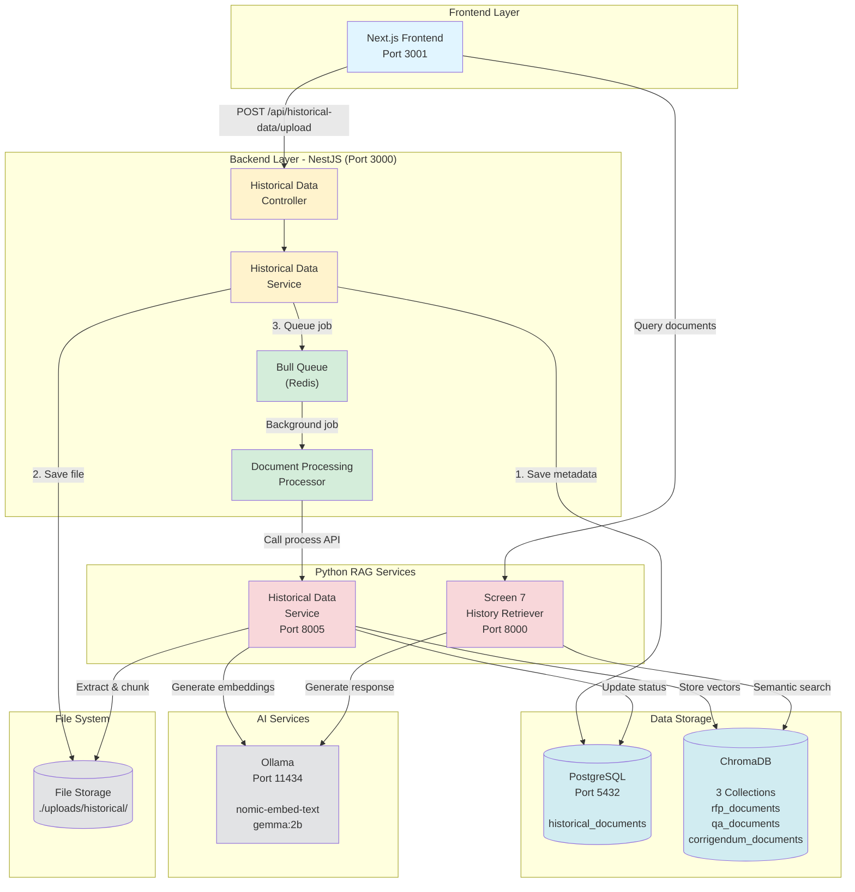
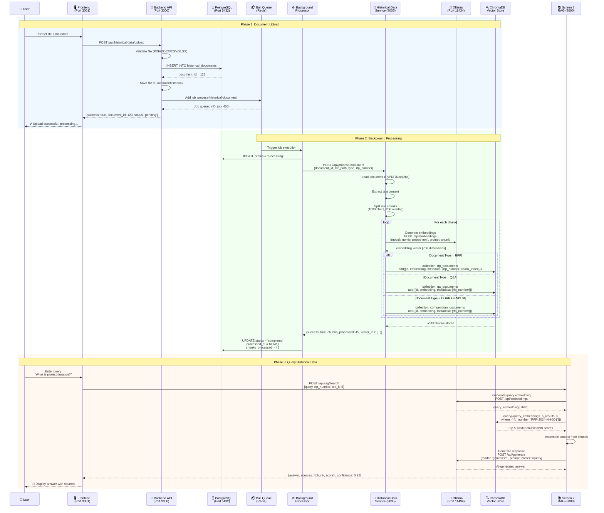
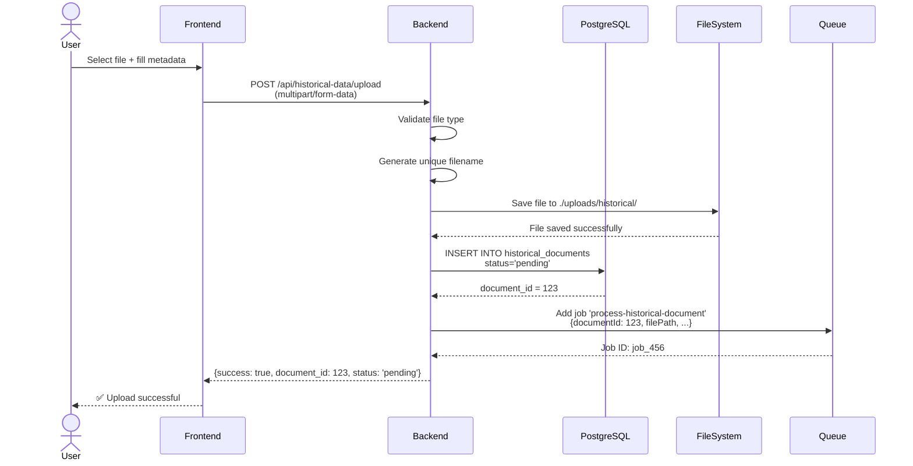
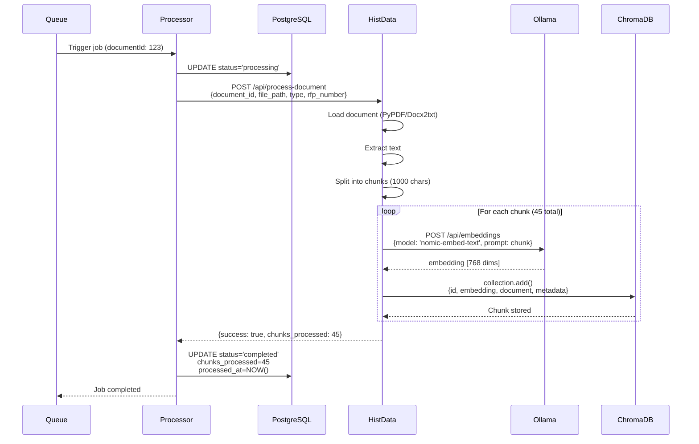
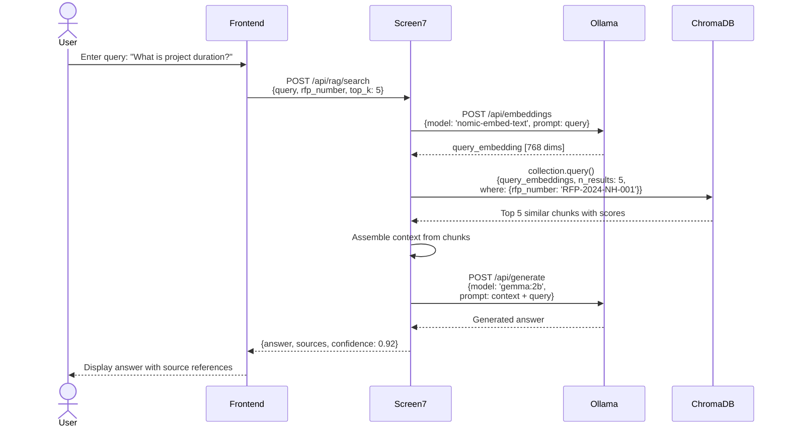

# Screen 7: Historical Data Upload System - Complete Data Flow

**Document:** Screen 7 Data Flow Architecture  
**Date:** January 27, 2026  
**Version:** 1.0  
**Status:** ✅ Production Ready

---

## Table of Contents

1. [System Overview](#system-overview)
2. [Architecture Components](#architecture-components)
3. [Complete Data Flow Diagram (Mermaid)](#complete-data-flow-diagram-mermaid)
4. [API Endpoints](#api-endpoints)
5. [PostgreSQL Database Schema](#postgresql-database-schema)
6. [Vector Database (ChromaDB)](#vector-database-chromadb)
7. [Embedding Process](#embedding-process)
8. [Data Flow Sequences](#data-flow-sequences)
9. [Background Processing](#background-processing)
10. [Error Handling & Retry](#error-handling--retry)

---

## System Overview

**Screen 7** (Historical Data Upload & Retrieval) manages the complete lifecycle of historical RFP documents, Q&A pairs, and corrigendums. The system provides:

- **Document Upload:** Multi-format file upload (PDF, DOCX, CSV, XLSX)
- **Metadata Storage:** PostgreSQL for structured data
- **Vector Storage:** ChromaDB for semantic search
- **Background Processing:** Bull queue for async document processing
- **RAG Integration:** Python services for document chunking and embedding
- **Query Interface:** Semantic search across historical documents

### Key Services

| Service | Port | Technology | Purpose |
|---------|------|------------|---------|
| Backend (NestJS) | 3000 | Node.js + TypeScript | API Gateway, Database, Queue Management |
| Screen 7 (History Retriever) | 8000 | Python + FastAPI | RAG search, document ingestion |
| Historical Data Service | 8005 | Python + FastAPI | Document processing, embeddings |
| PostgreSQL | 5432 | PostgreSQL 14 | Metadata storage |
| ChromaDB | N/A | Vector DB | Embeddings storage |
| Ollama | 11434 | LLM Service | Embeddings & text generation |
| Bull Queue | Redis | Message Queue | Background job processing |

---

## Architecture Components



---

## Complete Data Flow Diagram (Mermaid)

### Full Upload to Query Flow



---

## API Endpoints

### Backend (NestJS) - Port 3000

#### 1. Upload Historical Document

**Endpoint:** `POST /api/historical-data/upload`  
**Content-Type:** `multipart/form-data`

**Request Body:**
```typescript
{
  file: File;                    // Binary file (PDF, DOCX, CSV, XLSX)
  rfp_number: string;            // e.g., "RFP-2024-NH-001"
  title: string;                 // e.g., "Mumbai-Pune Expressway"
  document_type: "RFP" | "Q&A" | "CORRIGENDUM";
  description?: string;          // Optional description
}
```

**Response:**
```json
{
  "success": true,
  "document_id": 123,
  "status": "pending",
  "message": "Document uploaded. Processing in background..."
}
```

**Database Operations:**
- `INSERT INTO historical_documents` - Save metadata
- Queue job: `process-historical-document`

---

#### 2. Get All Documents (with Pagination)

**Endpoint:** `GET /api/historical-data`

**Query Parameters:**
```typescript
{
  page?: number;               // Default: 1
  pageSize?: number;          // Default: 20
  status?: string;            // Filter: 'pending', 'processing', 'completed', 'failed'
  document_type?: string;     // Filter: 'RFP', 'Q&A', 'CORRIGENDUM'
  rfp_number?: string;        // Filter by RFP
  sortBy?: string;            // Sort field
  sortOrder?: 'ASC' | 'DESC';
}
```

**Response:**
```json
{
  "data": [
    {
      "id": 123,
      "rfp_number": "RFP-2024-NH-001",
      "title": "Mumbai-Pune Expressway Development",
      "document_type": "RFP",
      "status": "completed",
      "file_name": "rfp_document.pdf",
      "file_size": 2458624,
      "chunks_processed": 45,
      "uploaded_at": "2026-01-20T10:30:00Z",
      "processed_at": "2026-01-20T10:35:00Z"
    }
  ],
  "pagination": {
    "total": 150,
    "page": 1,
    "pageSize": 20,
    "totalPages": 8
  }
}
```

---

#### 3. Get Document by ID

**Endpoint:** `GET /api/historical-data/:id`

**Response:**
```json
{
  "id": 123,
  "rfp_number": "RFP-2024-NH-001",
  "title": "Mumbai-Pune Expressway Development",
  "document_type": "RFP",
  "status": "completed",
  "file_name": "rfp_document.pdf",
  "file_path": "./uploads/historical/1737372000000-rfp_document.pdf",
  "file_size": 2458624,
  "file_type": "application/pdf",
  "chunks_processed": 45,
  "processing_metadata": {
    "total_pages": 156,
    "total_words": 45620,
    "embedding_model": "nomic-embed-text",
    "processing_duration": 32.5
  },
  "uploaded_at": "2026-01-20T10:30:00Z",
  "processed_at": "2026-01-20T10:35:00Z",
  "ai_reference_count": 12
}
```

---

#### 4. Get Statistics

**Endpoint:** `GET /api/historical-data/stats/summary`

**Response:**
```json
{
  "total_documents": 150,
  "by_status": {
    "pending": 5,
    "processing": 2,
    "completed": 138,
    "failed": 5
  },
  "by_type": {
    "RFP": 45,
    "Q&A": 80,
    "CORRIGENDUM": 25
  },
  "total_chunks": 6750,
  "total_size_mb": 1250.5,
  "avg_processing_time": 28.3,
  "recent_uploads": [
    {
      "id": 150,
      "title": "Latest RFP",
      "uploaded_at": "2026-01-27T09:00:00Z"
    }
  ]
}
```

---

#### 5. Retry Failed Document

**Endpoint:** `POST /api/historical-data/:id/retry`

**Response:**
```json
{
  "success": true,
  "document_id": 123,
  "message": "Document requeued for processing"
}
```

**Actions:**
- Reset status to `pending`
- Clear error messages
- Re-queue job in Bull

---

#### 6. Query Document

**Endpoint:** `POST /api/historical-data/:id/query`

**Request Body:**
```json
{
  "question": "What is the project duration?"
}
```

**Response:**
```json
{
  "success": true,
  "document_id": 123,
  "question": "What is the project duration?",
  "answer": "The project duration is 24 months from the date of contract signing, as specified in Section 3.2 of the RFP document.",
  "sources": [
    {
      "content": "Project Timeline: The successful bidder shall complete the project within 24 months...",
      "metadata": {
        "chunk_index": 12,
        "page_number": 15,
        "section": "3.2"
      },
      "similarity": 0.92
    }
  ],
  "embedding_provider": "ollama",
  "processing_time": 2.3
}
```

---

#### 7. Delete Document

**Endpoint:** `DELETE /api/historical-data/:id`

**Response:**
```json
{
  "success": true,
  "document_id": 123,
  "message": "Document and all associated data deleted",
  "details": {
    "vectors_deleted": 45,
    "file_deleted": true,
    "database_record_deleted": true
  }
}
```

**Actions:**
- Delete from `historical_documents` table
- Delete vectors from ChromaDB
- Delete file from file system

---

### Historical Data Service (Python) - Port 8005

#### 1. Process Document

**Endpoint:** `POST /api/process-document`

**Request Body:**
```json
{
  "document_id": 123,
  "file_path": "./uploads/historical/1737372000000-rfp_document.pdf",
  "file_name": "rfp_document.pdf",
  "document_type": "RFP",
  "rfp_number": "RFP-2024-NH-001",
  "title": "Mumbai-Pune Expressway Development"
}
```

**Response:**
```json
{
  "success": true,
  "document_id": 123,
  "chunks_processed": 45,
  "vector_ids": [
    "doc_123_chunk_0",
    "doc_123_chunk_1",
    "..."
  ],
  "extracted_content": "Full extracted text...",
  "processing_time": 32.5,
  "embedding_provider": "ollama",
  "message": "Document processed successfully"
}
```

**Processing Steps:**
1. Load document (PyPDFLoader, Docx2txtLoader, etc.)
2. Extract text content
3. Split into chunks (RecursiveCharacterTextSplitter)
4. Generate embeddings (Ollama `nomic-embed-text`)
5. Store in ChromaDB with metadata

---

#### 2. Query Document

**Endpoint:** `POST /api/query-document`

**Request Body:**
```json
{
  "document_id": 123,
  "question": "What is the project duration?",
  "document_type": "RFP",
  "rfp_number": "RFP-2024-NH-001"
}
```

**Response:**
```json
{
  "success": true,
  "document_id": 123,
  "question": "What is the project duration?",
  "answer": "The project duration is 24 months from contract signing.",
  "sources": [
    {
      "content": "Project Timeline: 24 months...",
      "metadata": {"chunk_index": 12},
      "similarity": 0.92
    }
  ],
  "embedding_provider": "ollama",
  "processing_time": 2.3
}
```

---

#### 3. Delete Document Vectors

**Endpoint:** `DELETE /api/delete-document/:id`

**Response:**
```json
{
  "success": true,
  "document_id": 123,
  "vectors_deleted": 45,
  "message": "All vectors deleted from ChromaDB"
}
```

---

### Screen 7 (History Retriever) - Port 8000

#### 1. Health Check

**Endpoint:** `GET /api/health`

**Response:**
```json
{
  "status": "healthy",
  "service": "NHAI History Retriever Agent",
  "version": "1.0.0",
  "timestamp": "2026-01-27T10:00:00Z",
  "vector_store": "chromadb",
  "embedding_provider": "ollama",
  "llm_provider": "ollama"
}
```

---

#### 2. Ingest Document

**Endpoint:** `POST /api/ingest`

**Request Body:**
```json
{
  "document_id": "doc_123",
  "document_type": "rfp",
  "file_path": "./uploads/historical/document.pdf",
  "file_name": "document.pdf",
  "rfp_number": "RFP-2024-NH-001",
  "title": "Mumbai-Pune Expressway",
  "metadata": {
    "description": "Historical RFP for reference"
  }
}
```

**Response:**
```json
{
  "success": true,
  "document_id": "doc_123",
  "chunks_processed": 45,
  "vector_store_id": "nhai_historical_data",
  "processing_time": 28.5,
  "message": "Document ingested and vectorized successfully"
}
```

---

#### 3. Semantic Search

**Endpoint:** `POST /api/rag/search`

**Request Body:**
```json
{
  "query": "What is the project duration?",
  "top_k": 5,
  "document_type": "rfp",
  "rfp_number": "RFP-2024-NH-001",
  "filter": {
    "document_type": "rfp"
  }
}
```

**Response:**
```json
{
  "success": true,
  "query": "What is the project duration?",
  "results": [
    {
      "document_id": "doc_123",
      "chunk_id": "doc_123_chunk_12",
      "content": "Project Timeline: The successful bidder shall complete the project within 24 months from the date of contract signing...",
      "score": 0.92,
      "metadata": {
        "rfp_number": "RFP-2024-NH-001",
        "document_type": "rfp",
        "chunk_index": 12,
        "title": "Mumbai-Pune Expressway"
      }
    },
    {
      "document_id": "doc_123",
      "chunk_id": "doc_123_chunk_15",
      "content": "Section 3.2 - Project Duration and Milestones: Phase 1 (Months 1-12)...",
      "score": 0.87,
      "metadata": {
        "rfp_number": "RFP-2024-NH-001",
        "chunk_index": 15
      }
    }
  ],
  "execution_time": 0.85,
  "total_results": 5
}
```

---

#### 4. Get Configuration

**Endpoint:** `GET /api/config`

**Response:**
```json
{
  "embedding_provider": "ollama",
  "embedding_model": "nomic-embed-text",
  "llm_provider": "ollama",
  "llm_model": "gemma:2b",
  "chunk_size": 1000,
  "chunk_overlap": 200,
  "top_k": 5,
  "vector_store_type": "chromadb",
  "enable_cache": true,
  "ollama_base_url": "http://localhost:11434"
}
```

---

#### 5. Get Statistics

**Endpoint:** `GET /api/statistics`

**Response:**
```json
{
  "total_documents": 150,
  "total_chunks": 6750,
  "total_searches": 1250,
  "total_transactions": 2500,
  "vector_store_size_mb": 450.5,
  "uptime_seconds": 86400
}
```

---

## PostgreSQL Database Schema

### Table: historical_documents

```sql
CREATE TABLE historical_documents (
    -- Primary Key
    id SERIAL PRIMARY KEY,
    
    -- Document Metadata
    rfp_number VARCHAR(100) NOT NULL,
    title VARCHAR(500) NOT NULL,
    document_type VARCHAR(50) NOT NULL CHECK (document_type IN ('RFP', 'Q&A', 'CORRIGENDUM')),
    description TEXT,
    
    -- File Information
    file_path VARCHAR(1000) NOT NULL,
    file_name VARCHAR(500) NOT NULL,
    file_size BIGINT NOT NULL,
    file_type VARCHAR(100) NOT NULL,
    
    -- Processing Status
    status VARCHAR(50) DEFAULT 'pending' CHECK (status IN ('pending', 'processing', 'completed', 'failed')),
    error_message TEXT,
    
    -- Processing Metadata
    chunks_processed INTEGER DEFAULT 0,
    processing_metadata JSONB,
    
    -- Timestamps
    uploaded_at TIMESTAMP DEFAULT CURRENT_TIMESTAMP,
    processed_at TIMESTAMP,
    
    -- AI References
    ai_reference_count INTEGER DEFAULT 0,
    last_referenced_at TIMESTAMP,
    
    -- Soft Delete
    deleted_at TIMESTAMP
);

-- Indexes for Performance
CREATE INDEX idx_historical_documents_rfp_number ON historical_documents(rfp_number);
CREATE INDEX idx_historical_documents_document_type ON historical_documents(document_type);
CREATE INDEX idx_historical_documents_status ON historical_documents(status);
CREATE INDEX idx_historical_documents_uploaded_at ON historical_documents(uploaded_at);
CREATE INDEX idx_historical_documents_deleted_at ON historical_documents(deleted_at) WHERE deleted_at IS NULL;
```

### TypeORM Entity

**File:** `backend/src/historical-data/entities/historical-document.entity.ts`

```typescript
@Entity('historical_documents')
export class HistoricalDocument {
  @PrimaryGeneratedColumn()
  id: number;

  @Column({ type: 'varchar', length: 100 })
  @Index()
  rfp_number: string;

  @Column({ type: 'varchar', length: 500 })
  title: string;

  @Column({
    type: 'enum',
    enum: ['RFP', 'Q&A', 'CORRIGENDUM'],
  })
  @Index()
  document_type: string;

  @Column({ type: 'text', nullable: true })
  description: string;

  @Column({ type: 'varchar', length: 1000 })
  file_path: string;

  @Column({ type: 'varchar', length: 500 })
  file_name: string;

  @Column({ type: 'bigint' })
  file_size: number;

  @Column({ type: 'varchar', length: 100 })
  file_type: string;

  @Column({
    type: 'enum',
    enum: ['pending', 'processing', 'completed', 'failed'],
    default: 'pending',
  })
  @Index()
  status: string;

  @Column({ type: 'text', nullable: true })
  error_message: string;

  @Column({ type: 'int', default: 0 })
  chunks_processed: number;

  @Column({ type: 'jsonb', nullable: true })
  processing_metadata: Record<string, any>;

  @CreateDateColumn()
  @Index()
  uploaded_at: Date;

  @Column({ type: 'timestamp', nullable: true })
  processed_at: Date;

  @Column({ type: 'int', default: 0 })
  ai_reference_count: number;

  @Column({ type: 'timestamp', nullable: true })
  last_referenced_at: Date;

  @Column({ type: 'timestamp', nullable: true })
  @Index()
  deleted_at: Date;
}
```

---

## Vector Database (ChromaDB)

### Collections Structure

ChromaDB stores document embeddings in three separate collections:

#### 1. Collection: rfp_documents

**Purpose:** Store RFP document chunks with embeddings

**Schema:**
```python
{
    "id": str,                    # Unique chunk ID: "doc_{document_id}_chunk_{index}"
    "embedding": List[float],     # 768-dimensional vector from nomic-embed-text
    "document": str,              # Chunk text content
    "metadata": {
        "document_id": int,       # PostgreSQL document ID
        "rfp_number": str,        # e.g., "RFP-2024-NH-001"
        "title": str,             # Document title
        "document_type": "RFP",
        "chunk_index": int,       # Chunk sequence number
        "file_name": str,
        "uploaded_at": str,       # ISO timestamp
        "page_number": int,       # Optional: page reference
        "section": str,           # Optional: section reference
    }
}
```

**Embedding Model:** Ollama `nomic-embed-text` (768 dimensions)  
**Distance Metric:** Cosine similarity

---

#### 2. Collection: qa_documents

**Purpose:** Store Q&A document chunks

**Schema:**
```python
{
    "id": str,
    "embedding": List[float],
    "document": str,
    "metadata": {
        "document_id": int,
        "rfp_number": str,
        "title": str,
        "document_type": "Q&A",
        "chunk_index": int,
        "question": str,          # Original question
        "answer": str,            # Original answer
        "category": str,          # Question category
        "file_name": str,
        "uploaded_at": str,
    }
}
```

---

#### 3. Collection: corrigendum_documents

**Purpose:** Store corrigendum document chunks

**Schema:**
```python
{
    "id": str,
    "embedding": List[float],
    "document": str,
    "metadata": {
        "document_id": int,
        "rfp_number": str,
        "title": str,
        "document_type": "CORRIGENDUM",
        "chunk_index": int,
        "corrigendum_number": str,  # e.g., "CORR-01"
        "date_issued": str,
        "changes": List[str],        # List of changes
        "file_name": str,
        "uploaded_at": str,
    }
}
```

---

### ChromaDB Operations

#### Add Document Chunk
```python
collection.add(
    ids=["doc_123_chunk_0"],
    embeddings=[[0.023, -0.145, ...]],  # 768-dim vector
    documents=["Project Timeline: The successful bidder shall complete..."],
    metadatas=[{
        "document_id": 123,
        "rfp_number": "RFP-2024-NH-001",
        "chunk_index": 0,
        "document_type": "RFP"
    }]
)
```

#### Query Similar Chunks
```python
results = collection.query(
    query_embeddings=[[0.015, -0.132, ...]],  # Query embedding
    n_results=5,
    where={"rfp_number": "RFP-2024-NH-001"},  # Filter by RFP
    include=["documents", "metadatas", "distances"]
)
```

#### Delete Document Vectors
```python
collection.delete(
    where={"document_id": 123}
)
```

---

## Embedding Process

### Document to Embeddings Pipeline

```mermaid
flowchart LR
    subgraph "1. Document Loading"
        Doc["PDF/DOCX<br/>Document"]
        Loader["Loader<br/>(PyPDF/Docx2txt)"]
        Text["Raw Text<br/>Content"]
    end
    
    subgraph "2. Text Chunking"
        Splitter["RecursiveCharacterTextSplitter<br/>chunk_size=1000<br/>overlap=200"]
        Chunks["Text Chunks<br/>[Chunk0, Chunk1, ...]"]
    end
    
    subgraph "3. Embedding Generation"
        OllamaEmbed["Ollama API<br/>POST /api/embeddings<br/>model: nomic-embed-text"]
        Vectors["Embedding Vectors<br/>768 dimensions"]
    end
    
    subgraph "4. Vector Storage"
        Metadata["Add Metadata<br/>{doc_id, rfp_number, chunk_index}"]
        ChromaStore["ChromaDB<br/>collection.add()"]
    end
    
    Doc --> Loader
    Loader --> Text
    Text --> Splitter
    Splitter --> Chunks
    
    Chunks --> OllamaEmbed
    OllamaEmbed --> Vectors
    
    Vectors --> Metadata
    Metadata --> ChromaStore
    
    style Doc fill:#e1f5ff
    style Loader fill:#fff3cd
    style Text fill:#d4edda
    style Splitter fill:#fff3cd
    style Chunks fill:#d4edda
    style OllamaEmbed fill:#f8d7da
    style Vectors fill:#d1ecf1
    style Metadata fill:#fff3cd
    style ChromaStore fill:#d1ecf1
```



### Embedding Configuration

**Model:** Ollama `nomic-embed-text`  
**Dimensions:** 768  
**Context Window:** 8192 tokens  
**Average Processing Time:** 0.05s per chunk

**Text Splitting:**
- **Chunk Size:** 1000 characters
- **Chunk Overlap:** 200 characters
- **Separators:** `["\n\n", "\n", ". ", " ", ""]`
- **Length Function:** `len()` (character-based)

**Metadata Attached:**
- `document_id`: PostgreSQL ID
- `rfp_number`: RFP reference
- `chunk_index`: Sequence number
- `document_type`: RFP/Q&A/CORRIGENDUM
- `title`: Document title
- `uploaded_at`: Timestamp

---

## Data Flow Sequences

### Sequence 1: Document Upload Flow



---

### Sequence 2: Background Processing Flow



---

### Sequence 3: Query/Search Flow



---

## Background Processing

### Bull Queue Configuration

**Queue Name:** `document-processing`  
**Job Name:** `process-historical-document`  
**Storage:** Redis

**Job Options:**
```typescript
{
  attempts: 3,                    // Retry up to 3 times
  backoff: {
    type: 'exponential',         // Exponential backoff
    delay: 5000                  // Start with 5 second delay
  },
  removeOnComplete: false,       // Keep completed jobs for auditing
  removeOnFail: false            // Keep failed jobs for debugging
}
```

**Job Data:**
```typescript
{
  documentId: number;
  filePath: string;
  fileName: string;
  fileType: string;
  documentType: 'RFP' | 'Q&A' | 'CORRIGENDUM';
  rfpNumber: string;
  title: string;
}
```

### Processor Implementation

**File:** `backend/src/historical-data/processors/document-processing-rag.processor.ts`

**Processing Steps:**

1. **Update Status → 'processing'**
   ```typescript
   await this.updateDocumentStatus(documentId, 'processing');
   ```

2. **Call Historical Data Service**
   ```typescript
   const response = await axios.post('http://localhost:8005/api/process-document', {
     document_id: documentId,
     file_path: filePath,
     file_name: fileName,
     document_type: documentType,
     rfp_number: rfpNumber,
     title: title
   });
   ```

3. **Update Status → 'completed'**
   ```typescript
   await this.updateDocumentStatus(documentId, 'completed', {
     chunks_processed: response.chunks_processed,
     processing_metadata: response.metadata
   });
   ```

4. **Error Handling**
   ```typescript
   catch (error) {
     await this.updateDocumentStatus(documentId, 'failed', {
       error_message: error.message
     });
     throw error;  // Triggers retry
   }
   ```

---

## Error Handling & Retry

### Retry Strategy

**Automatic Retries:**
- Max attempts: 3
- Backoff: Exponential (5s, 10s, 20s)
- Status transitions: `failed` → `pending` → `processing`

**Manual Retry:**
- Endpoint: `POST /api/historical-data/:id/retry`
- Clears error message
- Resets status to `pending`
- Re-queues job

### Common Failure Scenarios

| Error | Cause | Resolution |
|-------|-------|------------|
| File not found | File deleted before processing | Re-upload document |
| Ollama connection failed | Ollama service down | Start Ollama, retry |
| ChromaDB error | Database connection issue | Check ChromaDB service, retry |
| Invalid file format | Corrupted file | Re-upload valid file |
| Out of memory | Large document | Reduce chunk size, retry |

### Error Response Format

```json
{
  "success": false,
  "document_id": 123,
  "status": "failed",
  "error_message": "Failed to connect to Ollama service: Connection refused",
  "error_code": "OLLAMA_CONNECTION_ERROR",
  "retry_available": true,
  "timestamp": "2026-01-27T10:00:00Z"
}
```

---

## Testing Commands

### Upload Document

**PowerShell:**
```powershell
$file = "C:\Documents\rfp_document.pdf"
$form = @{
    file = Get-Item -Path $file
    rfp_number = "RFP-2024-NH-001"
    title = "Mumbai-Pune Expressway Development"
    document_type = "RFP"
    description = "Historical RFP for reference"
}

Invoke-RestMethod -Uri http://localhost:3000/api/historical-data/upload `
    -Method Post -Form $form | ConvertTo-Json
```

### Get All Documents

```powershell
Invoke-RestMethod -Uri "http://localhost:3000/api/historical-data?page=1&pageSize=10" | ConvertTo-Json -Depth 10
```

### Get Document by ID

```powershell
Invoke-RestMethod -Uri http://localhost:3000/api/historical-data/123 | ConvertTo-Json
```

### Query Document

```powershell
$body = @{
    question = "What is the project duration?"
} | ConvertTo-Json

Invoke-RestMethod -Uri http://localhost:3000/api/historical-data/123/query `
    -Method Post -Body $body -ContentType "application/json" | ConvertTo-Json
```

### Screen 7 Search

```powershell
$body = @{
    query = "What is the project duration?"
    top_k = 5
    rfp_number = "RFP-2024-NH-001"
} | ConvertTo-Json

Invoke-RestMethod -Uri http://localhost:8000/api/rag/search `
    -Method Post -Body $body -ContentType "application/json" | ConvertTo-Json -Depth 10
```

---

## Related Documentation

- **Bulk Operations:** `BULK-Chat-Information.md`
- **Screen 7 Export:** `SESSION_SCREEN7_BULK_UPDATE_EXPORT.md`
- **Screen 8 (Prebid Queries):** `SCREEN8-PREBID-QUERY-MANAGEMENT.md`
- **Commands Guide:** `README-COMMANDS-V3.md`
- **Vectorization Guide:** `vectorization-rag-steps-manual/VECTORIZATION_SETUP_GUIDE.md`

---

**Last Updated:** January 27, 2026  
**Version:** 1.0  
**Status:** ✅ Production Ready
