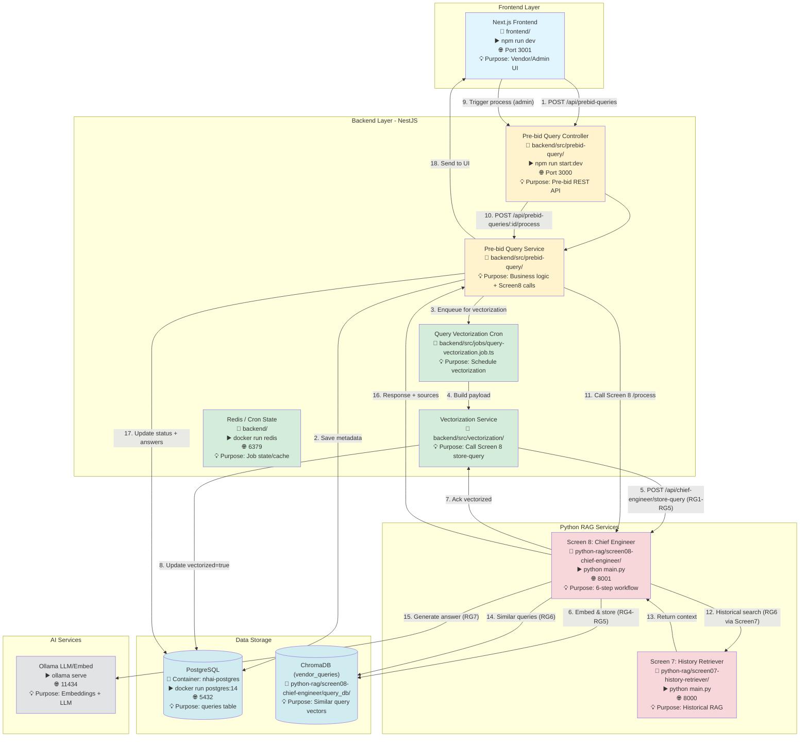
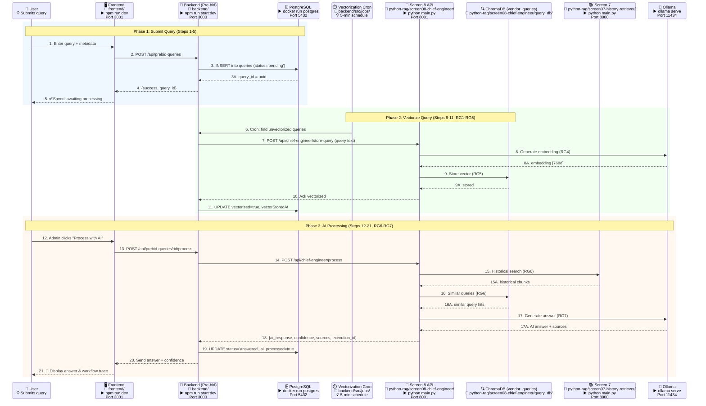
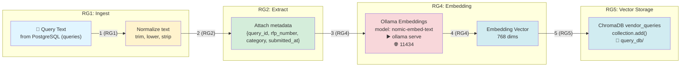
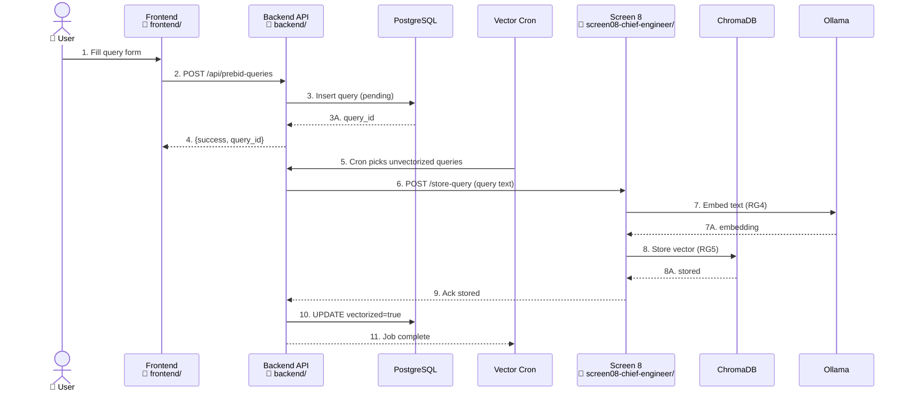
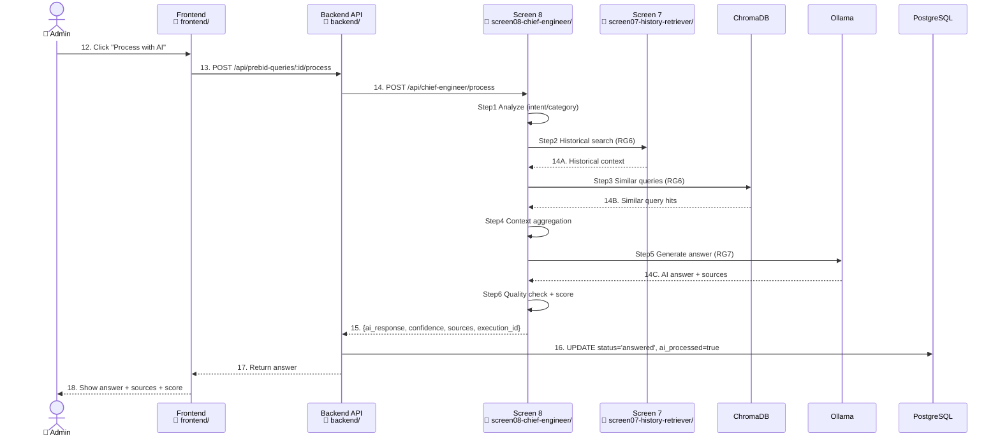
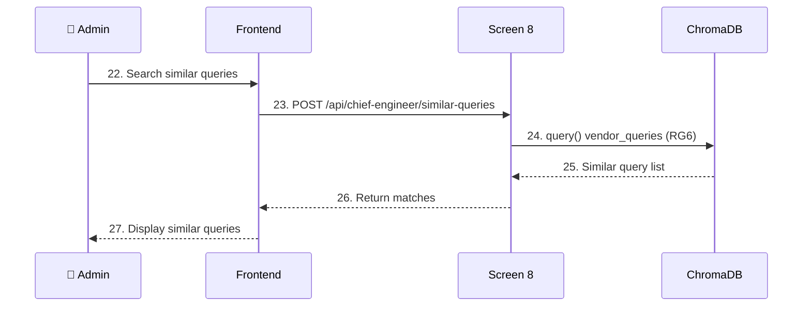

# Screen 8: Pre-bid Query Management - Complete Data Flow (V1)

**Document:** Screen 8 Data Flow Architecture with Numbered Sequences & RAG Flow Mapping  
**Date:** January 27, 2026  
**Version:** 1.0  
**Status:** ✅ Production Ready  
**Scope:** Mirrors the detail and structure of Screen 7 V3 (numbered flows, RG1-RG7, purpose notes)

---

## Table of Contents

1. [System Overview](#system-overview)
2. [Service Startup Commands](#service-startup-commands)
3. [Architecture Components with Commands](#architecture-components-with-commands)
4. [Enhanced Data Flow Diagram with Numbered Sequences](#enhanced-data-flow-diagram-with-numbered-sequences)
5. [API Endpoints](#api-endpoints)
6. [PostgreSQL Database Schema](#postgresql-database-schema)
7. [Vector Database (ChromaDB)](#vector-database-chromadb)
8. [Embedding Process with RAG Flow Mapping](#embedding-process-with-rag-flow-mapping)
9. [Data Flow Sequences](#data-flow-sequences)
10. [Background Vectorization Job](#background-vectorization-job)
11. [Error Handling & Retry](#error-handling--retry)

---

## System Overview

**Screen 8** (Pre-bid Query Management / Chief Engineer Agent) handles vendor queries with a 6-step agentic RAG workflow, integrates with Screen 7 for historical context, and stores embeddings for similar-query retrieval.

- **Query Intake:** Vendors submit queries via frontend → backend → PostgreSQL
- **Vectorization:** Scheduled job sends queries to Screen 8 to embed and store in ChromaDB
- **RAG Processing:** ChiefEngineerAgent (Python) runs 6-step workflow (analysis, historical search, similar queries, context build, response, quality check)
- **Context Sources:** Screen 7 semantic search + Screen 8 similar queries + RFP metadata
- **Outputs:** AI answer, confidence, sources, workflow execution trail

### Key Services with Startup Commands

| Service | Port | Folder | Startup Command | Technology | Purpose |
|---------|------|--------|-----------------|------------|---------|
| Backend (NestJS) | 3000 | `backend/` | `npm run start:dev` | Node.js + TypeScript | API gateway & jobs |
| Frontend (Next.js) | 3001 | `frontend/` | `npm run dev` | React + Next.js | Vendor/admin UI |
| Screen 8 (Chief Engineer) | 8001 | `python-rag/screen08-chief-engineer/` | `python main.py` | Python + FastAPI | 6-step query workflow |
| Screen 7 (History Retriever) | 8000 | `python-rag/screen07-history-retriever/` | `python main.py` | Python + FastAPI | Historical RAG search |
| PostgreSQL | 5432 | N/A | `docker run postgres:14` | PostgreSQL 14 | Query metadata storage |
| Redis (Bull/cron) | 6379 | N/A | `docker run redis` | Redis | Jobs & caching (backend) |
| Ollama | 11434 | N/A | `ollama serve` | LLM/Embeddings | Embeddings + LLM inference |
| ChromaDB | N/A | `python-rag/screen08-chief-engineer/query_db/` | Embedded | Vector DB for queries |

---

## Service Startup Commands

### 1. Start PostgreSQL
```bash
# Purpose: Store pre-bid queries and workflow status
docker run -d --name nhai-postgres -e POSTGRES_PASSWORD=your_password -e POSTGRES_DB=nhai_tender_db -p 5432:5432 postgres:14
```

### 2. Start Redis
```bash
# Purpose: Backend queues/cron state
docker run -d --name nhai-redis -p 6379:6379 redis:latest
```

### 3. Start Ollama
```bash
# Purpose: Embeddings + LLM for Screen 8
ollama serve
ollama pull nomic-embed-text   # embeddings (768d)
ollama pull gemma3:1b           # LLM (default in Screen 8)
```

### 4. Start Backend (NestJS)
```bash
cd backend/
npm run start:dev
```
Port 3000

### 5. Start Frontend (Next.js)
```bash
cd frontend/
npm run dev
```
Port 3001

### 6. Start Screen 7 (History Retriever)
```bash
cd python-rag/screen07-history-retriever/
python main.py
```
Port 8000

### 7. Start Screen 8 (Chief Engineer)
```bash
cd python-rag/screen08-chief-engineer/
python main.py
```
Port 8001 (via `START_SCREEN8_FIXED.bat` with venv activation)

---

## Architecture Components with Commands



---

## Enhanced Data Flow Diagram with Numbered Sequences

### Complete Flow (Submit → Vectorize → Process → Answer)



**RAG Flow Mapping Legend:** RG1 Ingest → RG2 Extract → RG3 Chunk (not used) → RG4 Embed → RG5 Store → RG6 Retrieve → RG7 Generate

---

## API Endpoints

### Backend (NestJS) - Pre-bid Module (Port 3000)
Folder: `backend/src/prebid-query/`

1) `GET /api/prebid-queries/statistics` — Stats (pending/answered, avg response)
2) `GET /api/prebid-queries` — List queries (filters: status, category, rfpId, aiProcessed, page/pageSize)
3) `GET /api/prebid-queries/:id` — Get query by UUID
4) `POST /api/prebid-queries/:id/process` — Trigger Screen 8 AI workflow
5) `PATCH /api/prebid-queries/:id/status` — Update status
6) `POST /api/prebid-queries/:id/admin-response` — Save admin response
7) `GET /api/prebid-queries/:id/history` — Audit trail
8) `GET /api/prebid-queries/:id/similar` — Similar queries (DB filter)
9) `GET /api/prebid-queries/workflow/executions` — List Screen 8 workflows
10) `GET /api/prebid-queries/workflow/executions/:executionId` — Workflow details

### Backend Vectorization Job/Service
- **Cron:** Every 5 minutes (`query-vectorization.job.ts`)
- **Call:** `POST {SCREEN8_URL}/api/chief-engineer/store-query`
- **Updates:** `vectorized`, `vectorStoredAt` in PostgreSQL `queries`

### Screen 8 (Chief Engineer FastAPI) - Port 8001
Folder: `python-rag/screen08-chief-engineer/`

1) `GET /api/health` — Health & provider info
2) `POST /api/chief-engineer/store-query` — Embed + store query (RG1-RG5)
3) `POST /api/chief-engineer/process` — 6-step workflow (uses Screen 7 + Chroma)
4) `POST /api/chief-engineer/similar-queries` — Vector search in `vendor_queries`
5) `GET /api/workflow/executions` — List executions
6) `GET /api/workflow/executions/{id}` — Execution detail
7) `GET /api/statistics` — Service stats
8) `POST /api/chief-engineer/test` — Test workflow
9) `DELETE /api/chief-engineer/delete-query/{id}` — Remove vector entry (used by vectorization service)

### Screen 7 (History Retriever) - Port 8000
Used by Screen 8 step 2 (historical search) via `POST /api/rag/search`

---

## PostgreSQL Database Schema

### Table: `queries`
Purpose: Store pre-bid queries and AI processing results

| Column | Type | Purpose |
|--------|------|---------|
| query_id (uuid, PK) | uuid | Unique query identifier |
| query_number | varchar(50), unique | Human-friendly query number |
| rfp_id | uuid | RFP linkage |
| vendor_id | uuid | Vendor reference |
| category_id | int | Category reference |
| query_text | text | Query content |
| status | varchar(50) | pending/under_review/answered |
| priority | varchar(20) | low/medium/high |
| ai_processed | boolean | AI processed flag |
| admin_reviewed | boolean | Admin review flag |
| ai_response / past_ref_response / past_response | text | AI + reference answers |
| confidence | decimal(5,2) | Confidence score |
| source_documents | jsonb | Sources from Screen 8 |
| execution_id | varchar(100) | Workflow execution ID |
| submitted_at | timestamp | Submission time |
| processed_at | timestamp | AI processed time |
| answered_at | timestamp | Admin answered time |
| updated_at | timestamp | Last update |
| vectorized | boolean | Stored in Chroma flag |
| vectorStoredAt | timestamp | Vector storage time |

### Indexes
- `(rfp_id, status)`
- `vendor_id`
- `submitted_at`
- `status`
- `ai_processed`
- `vectorized`

---

## Vector Database (ChromaDB)

- **Collection:** `vendor_queries`
- **Folder:** `python-rag/screen08-chief-engineer/query_db/`
- **Dimensions:** 768 (Ollama `nomic-embed-text` by default)
- **Metadata:** `query_id`, `category`, `rfp_number`, `submitted_by`, `priority`, `submitted_at`, `rfp_title`, `project_name`
- **Usage:**
  - Store via `POST /api/chief-engineer/store-query` (Vectorization Job)
  - Search via `POST /api/chief-engineer/similar-queries` (RG6)

---

## Embedding Process with RAG Flow Mapping

### Query Vectorization Pipeline (RG1-RG5)


### RAG Standard Flow Mapping (Screen 8)
- **RG1:** Query ingestion (text from PostgreSQL)
- **RG2:** Text normalization + metadata assembly
- **RG3:** Chunking (N/A for short queries; treated as single chunk)
- **RG4:** Embedding via Ollama/OpenAI (configurable)
- **RG5:** Vector storage in `vendor_queries`
- **RG6:** Retriever (similar queries + Screen 7 historical search)
- **RG7:** LLM generation (compose historical + similar-query context)

---

## Data Flow Sequences

### Sequence 1: Submit & Vectorize Query (Steps 1-11)


### Sequence 2: AI Processing Workflow (Steps 12-21, 6-Step Agent)


### Sequence 3: Similar Query Search (Steps 22-27)


---

## Background Vectorization Job

- **File:** `backend/src/jobs/query-vectorization.job.ts`
- **Schedule:** Every 5 minutes (Cron)
- **Batch size:** `VECTORIZATION_BATCH_SIZE` (default 10)
- **Flow:** Find `vectorized=false` queries → call Screen 8 `/store-query` → update `vectorized=true` & `vectorStoredAt`
- **Retry:** Next cron run will pick any failures; errors logged

---

## Error Handling & Retry

- **Screen 8 unreachable:** `ECONNREFUSED` from `/store-query` → job logs failure; retried on next cron
- **Ollama down:** Embedding call fails (Step 7) → HTTP 500; query remains `vectorized=false`
- **Chroma error:** Storage failure (Step 8) → HTTP 500; retried next run
- **Process endpoint failure:** Backend returns 500; status remains `under_review`; admin can retry
- **Health checks:** `GET /api/health` (Screen 8) used by backend `vectorization.controller` health endpoint

---

## Summary

- Full Screen 8 data flow with numbered steps and RG1-RG7 mapping
- Architecture + sequences mirror Screen 7 V3 style
- One-line purpose notes on every component/participant
- Covers submission, vectorization, AI processing, and similar-query search
- References to concrete commands, folders, ports, and cron timings
