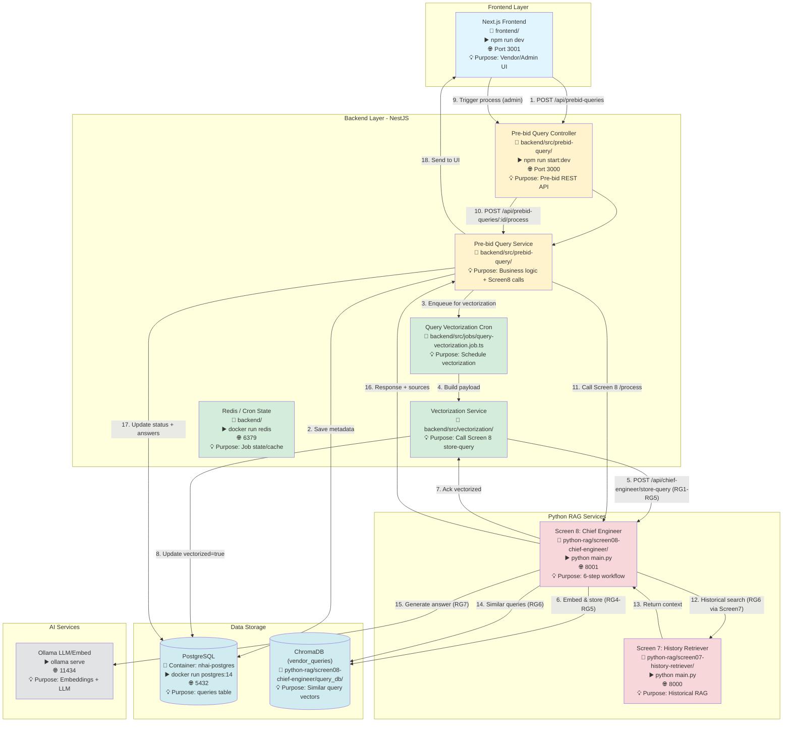
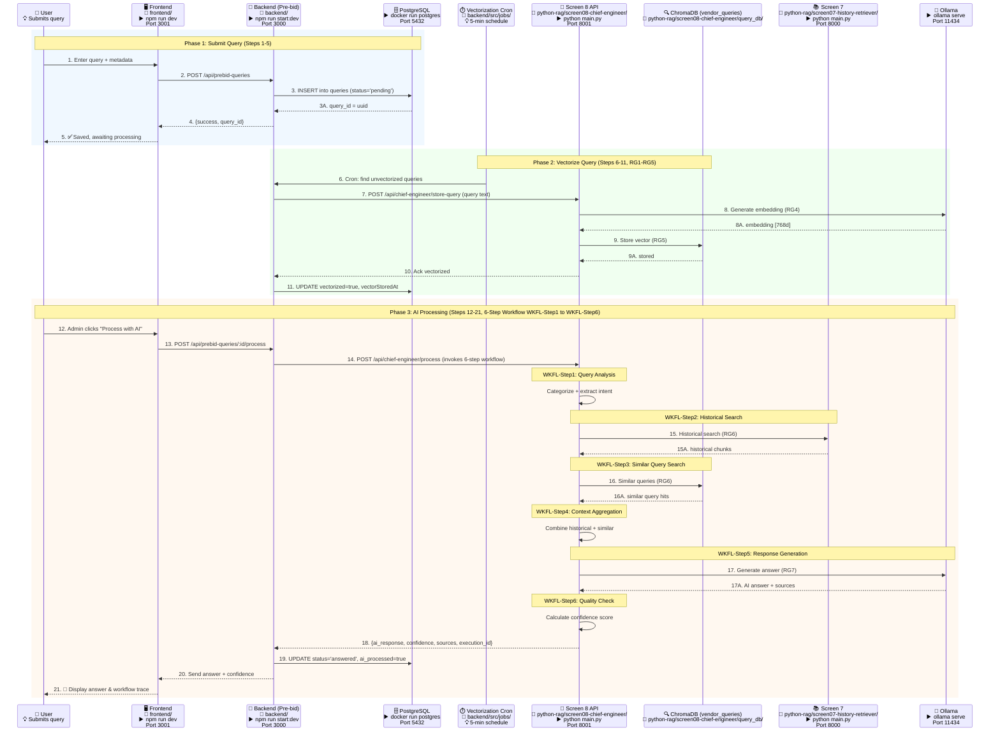
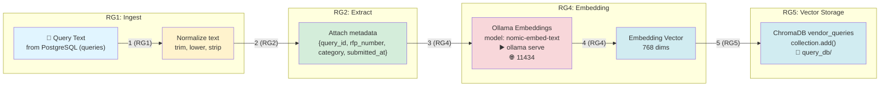
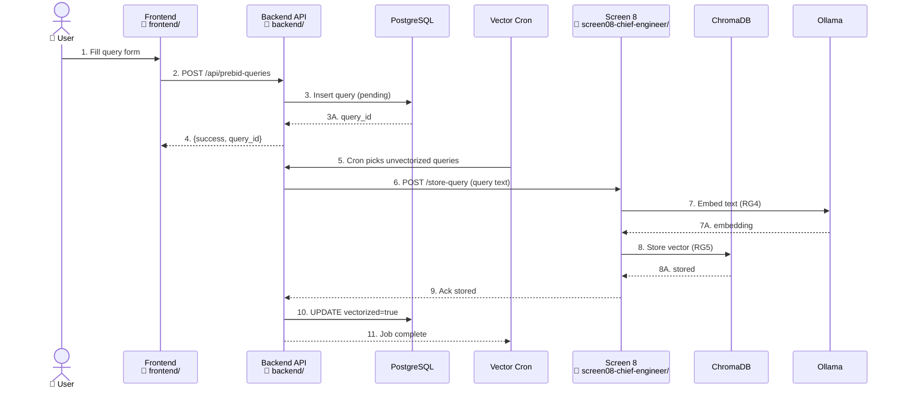
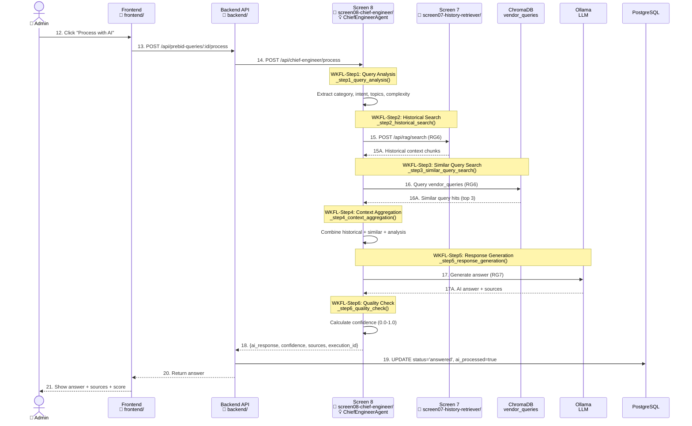
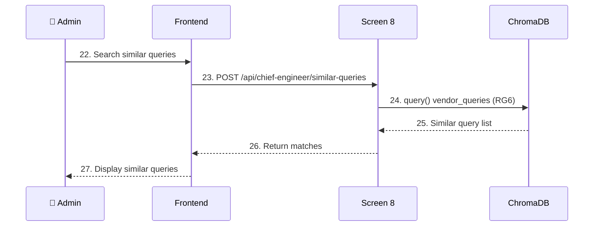

# Screen 8: Pre-bid Query Management - Complete Data Flow (V2)

**Document:** Screen 8 Data Flow Architecture with Numbered Sequences, RAG Flow Mapping & Workflow Implementation Details  
**Date:** January 28, 2026  
**Version:** 2.0  
**Status:** ✅ Production Ready  
**Scope:** Mirrors the detail and structure of Screen 7 V3 (numbered flows, RG1-RG7, purpose notes) + 6-Step Workflow Implementation Details

---

## Table of Contents

1. [System Overview](#system-overview)
2. [Service Startup Commands](#service-startup-commands)
3. [Architecture Components with Commands](#architecture-components-with-commands)
4. [Enhanced Data Flow Diagram with Numbered Sequences](#enhanced-data-flow-diagram-with-numbered-sequences)
5. [API Endpoints](#api-endpoints)
6. [PostgreSQL Database Schema](#postgresql-database-schema)
7. [Vector Database (ChromaDB)](#vector-database-chromadb)
8. [Embedding Process with RAG Flow Mapping](#embedding-process-with-rag-flow-mapping)
9. [Data Flow Sequences](#data-flow-sequences)
10. [Background Vectorization Job](#background-vectorization-job)
11. [Error Handling & Retry](#error-handling--retry)
12. [6-Step Chief Engineer Workflow - Implementation Details](#6-step-chief-engineer-workflow---implementation-details)

---

## System Overview

**Screen 8** (Pre-bid Query Management / Chief Engineer Agent) handles vendor queries with a 6-step agentic RAG workflow, integrates with Screen 7 for historical context, and stores embeddings for similar-query retrieval.

- **Query Intake:** Vendors submit queries via frontend → backend → PostgreSQL
- **Vectorization:** Scheduled job sends queries to Screen 8 to embed and store in ChromaDB
- **RAG Processing:** ChiefEngineerAgent (Python) runs 6-step workflow (analysis, historical search, similar queries, context build, response, quality check)
- **Context Sources:** Screen 7 semantic search + Screen 8 similar queries + RFP metadata
- **Outputs:** AI answer, confidence, sources, workflow execution trail

### Key Services with Startup Commands

| Service | Port | Folder | Startup Command | Technology | Purpose |
|---------|------|--------|-----------------|------------|---------|
| Backend (NestJS) | 3000 | `backend/` | `npm run start:dev` | Node.js + TypeScript | API gateway & jobs |
| Frontend (Next.js) | 3001 | `frontend/` | `npm run dev` | React + Next.js | Vendor/admin UI |
| Screen 8 (Chief Engineer) | 8001 | `python-rag/screen08-chief-engineer/` | `python main.py` | Python + FastAPI | 6-step query workflow |
| Screen 7 (History Retriever) | 8000 | `python-rag/screen07-history-retriever/` | `python main.py` | Python + FastAPI | Historical RAG search |
| PostgreSQL | 5432 | N/A | `docker run postgres:14` | PostgreSQL 14 | Query metadata storage |
| Redis (Bull/cron) | 6379 | N/A | `docker run redis` | Redis | Jobs & caching (backend) |
| Ollama | 11434 | N/A | `ollama serve` | LLM/Embeddings | Embeddings + LLM inference |
| ChromaDB | N/A | `python-rag/screen08-chief-engineer/query_db/` | Embedded | Vector DB for queries |

---

## Service Startup Commands

### 1. Start PostgreSQL
```bash
# Purpose: Store pre-bid queries and workflow status
docker run -d --name nhai-postgres -e POSTGRES_PASSWORD=your_password -e POSTGRES_DB=nhai_tender_db -p 5432:5432 postgres:14
```

### 2. Start Redis
```bash
# Purpose: Backend queues/cron state
docker run -d --name nhai-redis -p 6379:6379 redis:latest
```

### 3. Start Ollama
```bash
# Purpose: Embeddings + LLM for Screen 8
ollama serve
ollama pull nomic-embed-text   # embeddings (768d)
ollama pull gemma3:1b           # LLM (default in Screen 8)
```

### 4. Start Backend (NestJS)
```bash
cd backend/
npm run start:dev
```
Port 3000

### 5. Start Frontend (Next.js)
```bash
cd frontend/
npm run dev
```
Port 3001

### 6. Start Screen 7 (History Retriever)
```bash
cd python-rag/screen07-history-retriever/
python main.py
```
Port 8000

### 7. Start Screen 8 (Chief Engineer)
```bash
cd python-rag/screen08-chief-engineer/
python main.py
```
Port 8001 (via `START_SCREEN8_FIXED.bat` with venv activation)

---

## Architecture Components with Commands



---

## Enhanced Data Flow Diagram with Numbered Sequences

### Complete Flow (Submit → Vectorize → Process → Answer)



**RAG Flow Mapping Legend:** RG1 Ingest → RG2 Extract → RG3 Chunk (not used) → RG4 Embed → RG5 Store → RG6 Retrieve → RG7 Generate

**Workflow Mapping Legend:** WKFL-Step1 (Analysis) → WKFL-Step2 (Historical) → WKFL-Step3 (Similar) → WKFL-Step4 (Aggregate) → WKFL-Step5 (Generate) → WKFL-Step6 (Quality)

---

## API Endpoints

### Backend (NestJS) - Pre-bid Module (Port 3000)
Folder: `backend/src/prebid-query/`

1) `GET /api/prebid-queries/statistics` — Stats (pending/answered, avg response)
2) `GET /api/prebid-queries` — List queries (filters: status, category, rfpId, aiProcessed, page/pageSize)
3) `GET /api/prebid-queries/:id` — Get query by UUID
4) `POST /api/prebid-queries/:id/process` — Trigger Screen 8 AI workflow
5) `PATCH /api/prebid-queries/:id/status` — Update status
6) `POST /api/prebid-queries/:id/admin-response` — Save admin response
7) `GET /api/prebid-queries/:id/history` — Audit trail
8) `GET /api/prebid-queries/:id/similar` — Similar queries (DB filter)
9) `GET /api/prebid-queries/workflow/executions` — List Screen 8 workflows
10) `GET /api/prebid-queries/workflow/executions/:executionId` — Workflow details

### Backend Vectorization Job/Service
- **Cron:** Every 5 minutes (`query-vectorization.job.ts`)
- **Call:** `POST {SCREEN8_URL}/api/chief-engineer/store-query`
- **Updates:** `vectorized`, `vectorStoredAt` in PostgreSQL `queries`

### Screen 8 (Chief Engineer FastAPI) - Port 8001
Folder: `python-rag/screen08-chief-engineer/`

1) `GET /api/health` — Health & provider info
2) `POST /api/chief-engineer/store-query` — Embed + store query (RG1-RG5)
3) `POST /api/chief-engineer/process` — 6-step workflow (uses Screen 7 + Chroma)
4) `POST /api/chief-engineer/similar-queries` — Vector search in `vendor_queries`
5) `GET /api/workflow/executions` — List executions
6) `GET /api/workflow/executions/{id}` — Execution detail
7) `GET /api/statistics` — Service stats
8) `POST /api/chief-engineer/test` — Test workflow
9) `DELETE /api/chief-engineer/delete-query/{id}` — Remove vector entry (used by vectorization service)

### Screen 7 (History Retriever) - Port 8000
Used by Screen 8 step 2 (historical search) via `POST /api/rag/search`

---

## PostgreSQL Database Schema

### Table: `queries`
Purpose: Store pre-bid queries and AI processing results

| Column | Type | Purpose |
|--------|------|---------|
| query_id (uuid, PK) | uuid | Unique query identifier |
| query_number | varchar(50), unique | Human-friendly query number |
| rfp_id | uuid | RFP linkage |
| vendor_id | uuid | Vendor reference |
| category_id | int | Category reference |
| query_text | text | Query content |
| status | varchar(50) | pending/under_review/answered |
| priority | varchar(20) | low/medium/high |
| ai_processed | boolean | AI processed flag |
| admin_reviewed | boolean | Admin review flag |
| ai_response / past_ref_response / past_response | text | AI + reference answers |
| confidence | decimal(5,2) | Confidence score |
| source_documents | jsonb | Sources from Screen 8 |
| execution_id | varchar(100) | Workflow execution ID |
| submitted_at | timestamp | Submission time |
| processed_at | timestamp | AI processed time |
| answered_at | timestamp | Admin answered time |
| updated_at | timestamp | Last update |
| vectorized | boolean | Stored in Chroma flag |
| vectorStoredAt | timestamp | Vector storage time |

### Indexes
- `(rfp_id, status)`
- `vendor_id`
- `submitted_at`
- `status`
- `ai_processed`
- `vectorized`

---

## Vector Database (ChromaDB)

- **Collection:** `vendor_queries`
- **Folder:** `python-rag/screen08-chief-engineer/query_db/`
- **Dimensions:** 768 (Ollama `nomic-embed-text` by default)
- **Metadata:** `query_id`, `category`, `rfp_number`, `submitted_by`, `priority`, `submitted_at`, `rfp_title`, `project_name`
- **Usage:**
  - Store via `POST /api/chief-engineer/store-query` (Vectorization Job)
  - Search via `POST /api/chief-engineer/similar-queries` (RG6)

---

## Embedding Process with RAG Flow Mapping

### Query Vectorization Pipeline (RG1-RG5)


### RAG Standard Flow Mapping (Screen 8)
- **RG1:** Query ingestion (text from PostgreSQL)
- **RG2:** Text normalization + metadata assembly
- **RG3:** Chunking (N/A for short queries; treated as single chunk)
- **RG4:** Embedding via Ollama/OpenAI (configurable)
- **RG5:** Vector storage in `vendor_queries`
- **RG6:** Retriever (similar queries + Screen 7 historical search)
- **RG7:** LLM generation (compose historical + similar-query context)

---

## Data Flow Sequences

### Sequence 1: Submit & Vectorize Query (Steps 1-11)


### Sequence 2: AI Processing Workflow with 6-Step Agent (Steps 12-21, WKFL-Step1 to WKFL-Step6)


### Sequence 3: Similar Query Search (Steps 22-27)


---

## Background Vectorization Job

- **File:** `backend/src/jobs/query-vectorization.job.ts`
- **Schedule:** Every 5 minutes (Cron)
- **Batch size:** `VECTORIZATION_BATCH_SIZE` (default 10)
- **Flow:** Find `vectorized=false` queries → call Screen 8 `/store-query` → update `vectorized=true` & `vectorStoredAt`
- **Retry:** Next cron run will pick any failures; errors logged

---

## Error Handling & Retry

- **Screen 8 unreachable:** `ECONNREFUSED` from `/store-query` → job logs failure; retried on next cron
- **Ollama down:** Embedding call fails (Step 7) → HTTP 500; query remains `vectorized=false`
- **Chroma error:** Storage failure (Step 8) → HTTP 500; retried next run
- **Process endpoint failure:** Backend returns 500; status remains `under_review`; admin can retry
- **Health checks:** `GET /api/health` (Screen 8) used by backend `vectorization.controller` health endpoint

---

## 6-Step Chief Engineer Workflow - Implementation Details

### ✅ Implementation Status: **COMPLETE**

All 6 steps of the Chief Engineer workflow for Screen 8 are fully implemented and operational.

### Implementation Overview

| Step | Name | Implementation Status | Source Reference |
|------|------|----------------------|------------------|
| **WKFL-Step1** | Query Analysis | ✅ Implemented | `_step1_query_analysis()` in [chief_engineer_agent.py](python-rag/screen08-chief-engineer/chief_engineer_agent.py#L133-L192) |
| **WKFL-Step2** | Historical Search (Screen 7) | ✅ Implemented | `_step2_historical_search()` in [chief_engineer_agent.py](python-rag/screen08-chief-engineer/chief_engineer_agent.py#L194-L238) |
| **WKFL-Step3** | Similar Query Search (Screen 8) | ✅ Implemented | `_step3_similar_query_search()` in [chief_engineer_agent.py](python-rag/screen08-chief-engineer/chief_engineer_agent.py#L240-L297) |
| **WKFL-Step4** | Context Aggregation | ✅ Implemented | `_step4_context_aggregation()` in [chief_engineer_agent.py](python-rag/screen08-chief-engineer/chief_engineer_agent.py#L299-L354) |
| **WKFL-Step5** | Response Generation | ✅ Implemented | `_step5_response_generation()` in [chief_engineer_agent.py](python-rag/screen08-chief-engineer/chief_engineer_agent.py#L356-L467) |
| **WKFL-Step6** | Quality Check | ✅ Implemented | `_step6_quality_check()` in [chief_engineer_agent.py](python-rag/screen08-chief-engineer/chief_engineer_agent.py#L469-L540) |

---

### WKFL-Step1: Query Analysis (Lines 133-192)

**Method:** `_step1_query_analysis(query_id, query_text, rfp_context, workflow_id)`

**Purpose:** Classify query, extract intent, identify category, assess complexity

**Returns:** 
```python
{
    "category": "technical|commercial|eligibility|contractual|general",
    "intent": "clarification|information|objection",
    "key_topics": ["topic1", "topic2", ...],
    "complexity": "low|medium|high"
}
```

**Implementation Details:**
- **LLM Integration:** Uses Ollama LLM with PromptTemplate for analysis
- **Category Extraction:** `_extract_category()` parses LLM response for category keywords
- **Topic Extraction:** `_extract_key_topics()` filters query text for significant words (length > 4, excluding stop words)
- **Workflow Tracking:** Calls `workflow_manager.start_step(workflow_id, 1, "Query Analysis")` at start and `workflow_manager.complete_step(workflow_id, 1, analysis)` at completion
- **Error Handling:** Catches exceptions and calls `workflow_manager.fail_step(workflow_id, 1, str(e))`

**LLM Prompt Template:**
```python
"""Analyze this tender query and extract structured information.

RFP Context: {rfp_context}
Query: {query_text}

Provide:
1. Category (technical/commercial/eligibility/contractual)
2. Intent (clarification/information/objection)
3. Key topics (3-5 topics)
4. Complexity (low/medium/high)

Return ONLY a JSON object with these fields."""
```

**Helper Methods:**
- `_extract_category(llm_response: str) -> str` - Searches response for category keywords
- `_extract_key_topics(query_text: str) -> List[str]` - Filters significant words from query

---

### WKFL-Step2: Historical Search (Lines 194-238)

**Method:** `_step2_historical_search(query_id, query_text, rfp_context, workflow_id)`

**Purpose:** Search Screen 7 for similar historical queries and RFPs (RAG Retriever step - RG6)

**Integration:** Calls Screen 7 API `POST {screen7_url}/api/rag/search`

**Request Payload:**
```python
{
    "query": query_text,
    "top_k": 5,
    "filters": {
        "rfp_number": rfp_context.get("rfp_number")
    }
}
```

**Returns:** List of historical results with:
- `document_id` - Source document identifier
- `chunk_text` - Relevant text chunk
- `similarity_score` - Semantic similarity (0.0-1.0)
- `metadata` - Document metadata (rfp_number, doc_type, etc.)

**Implementation Details:**
- **HTTP Client:** Uses `httpx.AsyncClient` with 30-second timeout
- **Resilience:** Continues with empty results if Screen 7 fails (graceful degradation)
- **Workflow Tracking:** Records `results_count` and `sources` list in workflow step
- **Error Handling:** Logs error, fails workflow step, but returns `[]` to allow workflow continuation

**Example Response Processing:**
```python
data = response.json()
results = data.get("results", [])  # List of semantic search results
await self.workflow_manager.complete_step(workflow_id, 2, {
    "results_count": len(results),
    "sources": [r["document_id"] for r in results]
})
```

---

### WKFL-Step3: Similar Query Search (Lines 240-297)

**Method:** `_step3_similar_query_search(query_id, query_text, analysis, workflow_id)`

**Purpose:** Find similar queries in Screen 8's local database (RAG Retriever step - RG6)

**Storage:** Uses `self.similar_queries_db` (in-memory list, backed by PostgreSQL in production)

**Algorithm:** Text similarity calculation via `_calculate_text_similarity()` method

**Returns:** Top 3 similar queries with:
```python
{
    "query_id": stored_query["query_id"],
    "query_text": stored_query["query_text"],
    "response": stored_query.get("response", ""),
    "similarity": similarity,  # 0.0-1.0
    "confidence": stored_query.get("confidence_score", 0.0)
}
```

**Implementation Details:**
- **Similarity Threshold:** 0.6 (queries below this are filtered out)
- **Ranking:** Sorts by similarity score (descending)
- **Limit:** Returns top 3 matches
- **Workflow Tracking:** Records `similar_count` and `top_similarity` score

**Similarity Calculation:**
```python
def _calculate_text_similarity(self, text1: str, text2: str) -> float:
    """Calculate simple text similarity (would use embeddings in production)"""
    words1 = set(text1.lower().split())
    words2 = set(text2.lower().split())
    
    if not words1 or not words2:
        return 0.0
    
    intersection = len(words1.intersection(words2))
    union = len(words1.union(words2))
    
    return intersection / union if union > 0 else 0.0
```

**Production Note:** Current implementation uses Jaccard similarity. Production version would use ChromaDB vector search with embeddings for better semantic matching.

---

### WKFL-Step4: Context Aggregation (Lines 299-354)

**Method:** `_step4_context_aggregation(query_id, analysis, historical_results, similar_queries, workflow_id)`

**Purpose:** Combine all context sources into unified structure

**Combines:**
- Query analysis (Step 1)
- Historical sources from Screen 7 (Step 2)
- Similar queries from Screen 8 (Step 3)

**Returns:**
```python
{
    "query_analysis": analysis,
    "historical_sources": [
        {
            "source_id": r["document_id"],
            "text": r["chunk_text"],
            "similarity": r["similarity_score"],
            "metadata": r["metadata"]
        }
        for r in historical_results
    ],
    "similar_queries": similar_queries,
    "total_sources": len(historical_results) + len(similar_queries),
    "context_quality": self._assess_context_quality(
        historical_results,
        similar_queries
    )  # "excellent|good|fair|poor"
}
```

**Quality Assessment:** `_assess_context_quality()` method rates context as:
- **excellent:** Overall score > 0.8
- **good:** Overall score > 0.6
- **fair:** Overall score > 0.4
- **poor:** Overall score ≤ 0.4

**Quality Calculation:**
```python
avg_hist_score = (
    sum(r.get("similarity_score", 0) for r in historical_results) / len(historical_results)
    if historical_results else 0
)

avg_sim_score = (
    sum(q.get("similarity", 0) for q in similar_queries) / len(similar_queries)
    if similar_queries else 0
)

overall_score = (avg_hist_score + avg_sim_score) / 2
```

**Workflow Tracking:** Records `total_sources` and `context_quality` in workflow step

---

### WKFL-Step5: Response Generation (Lines 356-467)

**Method:** `_step5_response_generation(query_id, query_text, context, rfp_context, workflow_id)`

**Purpose:** Generate AI response using aggregated context (RAG Generation step - RG7)

**LLM Prompt:** Professional Chief Engineer response template
```python
"""You are a Chief Engineer responding to a pre-bid query for an NHAI highway project.

RFP: {rfp_number} - {rfp_title}
Category: {category}

Query: {query_text}

Available Context:
{context}

Generate a comprehensive, professional response that:
1. Directly addresses the query
2. References relevant tender clauses
3. Cites historical precedents if available
4. Maintains professional tone
5. Provides clear, actionable information

Response:"""
```

**Context Formatting:** `_format_context_for_llm()` structures context for LLM:
```
=== Historical RFP/Q&A Data ===

1. [first 300 chars of chunk 1]...
2. [first 300 chars of chunk 2]...
3. [first 300 chars of chunk 3]...

=== Similar Past Queries ===

1. Query: [similar query 1]
   Response: [first 200 chars of response]...
2. Query: [similar query 2]
   Response: [first 200 chars of response]...
```

**Returns:**
```python
{
    "response_text": ai_response.strip(),
    "past_ref_response": past_ref,  # Most similar query text
    "past_response": past_response,  # Most similar query's answer
    "sources": self._extract_sources(context),
    "context_used": context_str[:500]  # First 500 chars for logging
}
```

**Source Extraction:** `_extract_sources()` compiles all sources used:
```python
sources = []

for source in context["historical_sources"]:
    sources.append({
        "type": "historical",
        "source_id": source["source_id"],
        "similarity": source["similarity"]
    })

for query in context["similar_queries"]:
    sources.append({
        "type": "similar_query",
        "query_id": query["query_id"],
        "similarity": query["similarity"]
    })

return sources
```

**Workflow Tracking:** Records `response_length` and `sources_count` in workflow step

---

### WKFL-Step6: Quality Check (Lines 469-540)

**Method:** `_step6_quality_check(query_id, response, context, workflow_id)`

**Purpose:** Validate response quality and calculate confidence score (0.0-1.0)

**Returns:** Final response with quality metrics:
```python
{
    "response_text": response["response_text"],
    "past_ref_response": response.get("past_ref_response"),
    "past_response": response.get("past_response"),
    "confidence_score": confidence,  # 0.0-1.0
    "sources": response["sources"],
    "quality_metrics": {
        "is_complete": is_complete,  # Response > 50 chars
        "has_sources": has_sources,  # Has at least 1 source
        "context_quality": context["context_quality"],  # excellent/good/fair/poor
        "response_length": len(response["response_text"])
    }
}
```

**Confidence Score Calculation:** `_calculate_confidence_score()` considers:

1. **Base score:** 0.5
2. **Context quality bonus:** 
   - excellent: +0.3
   - good: +0.2
   - fair: +0.1
   - poor: +0.0
3. **Sources bonus:** +0.05 per source (max +0.15)
4. **Response length bonus:** +0.05 if > 200 chars

**Formula:**
```python
score = 0.5  # Base

# Context quality
quality_map = {"excellent": 0.3, "good": 0.2, "fair": 0.1, "poor": 0.0}
score += quality_map.get(context.get("context_quality", "poor"), 0.0)

# Sources
source_count = len(response.get("sources", []))
score += min(source_count * 0.05, 0.15)

# Length
response_length = len(response.get("response_text", ""))
if response_length > 200:
    score += 0.05

return min(round(score, 2), 1.0)  # Cap at 1.0
```

**Storage:** `_store_query_for_future()` saves query for future similar searches
```python
self.similar_queries_db.append({
    "query_id": query_id,
    "query_text": response.get("response_text", "")[:200],
    "response": response.get("response_text"),
    "confidence_score": confidence,
    "timestamp": datetime.now().isoformat()
})

# Keep only recent 1000 queries in memory
if len(self.similar_queries_db) > 1000:
    self.similar_queries_db = self.similar_queries_db[-1000:]
```

**Workflow Tracking:** Records `confidence_score` and `quality_passed` (boolean) in workflow step

---

### Workflow Orchestration

**Main Entry Point:** `process_query()` in [chief_engineer_agent.py](python-rag/screen08-chief-engineer/chief_engineer_agent.py#L82-L129)

```python
async def process_query(
    self,
    query_id: str,
    query_text: str,
    rfp_context: Dict[str, Any],
    vendor_id: Optional[str],
    workflow_id: str
) -> Dict[str, Any]:
    """
    Main entry point: Process query through 6-step workflow
    """
    try:
        logger.info(f"Processing query {query_id} through 6-step workflow")
        
        # Step 1: Query Analysis
        analysis = await self._step1_query_analysis(
            query_id, query_text, rfp_context, workflow_id
        )
        
        # Step 2: Historical Search (Screen 7)
        historical_results = await self._step2_historical_search(
            query_id, query_text, rfp_context, workflow_id
        )
        
        # Step 3: Similar Query Search (Screen 8 database)
        similar_queries = await self._step3_similar_query_search(
            query_id, query_text, analysis, workflow_id
        )
        
        # Step 4: Context Aggregation
        aggregated_context = await self._step4_context_aggregation(
            query_id, analysis, historical_results, similar_queries, workflow_id
        )
        
        # Step 5: Response Generation
        response = await self._step5_response_generation(
            query_id, query_text, aggregated_context, rfp_context, workflow_id
        )
        
        # Step 6: Quality Check
        final_response = await self._step6_quality_check(
            query_id, response, aggregated_context, workflow_id
        )
        
        # Mark workflow as completed
        await self.workflow_manager.complete_workflow(workflow_id, final_response)
        
        return final_response
        
    except Exception as e:
        logger.error(f"Query processing failed: {str(e)}")
        await self.workflow_manager.mark_workflow_failed(workflow_id, str(e))
        raise
```

**Error Handling:**
- Sequential execution: Each step must complete before next begins
- Step failure triggers `workflow_manager.fail_step()` and raises exception
- Workflow marked as failed via `workflow_manager.mark_workflow_failed()`
- Subsequent steps marked as "skipped" if earlier step fails

---

### Workflow Tracking: WorkflowManager Class

**File:** [workflow_manager.py](python-rag/screen08-chief-engineer/workflow_manager.py)

**Purpose:** Manages the 6-step agentic workflow execution with real-time status tracking for frontend visualization

**Workflow Steps Definition:**
```python
WORKFLOW_STEPS = [
    {"step_number": 1, "step_name": "Query Analysis"},
    {"step_number": 2, "step_name": "Historical Search (Screen 7)"},
    {"step_number": 3, "step_name": "Similar Query Search (Screen 8)"},
    {"step_number": 4, "step_name": "Context Aggregation"},
    {"step_number": 5, "step_name": "Response Generation"},
    {"step_number": 6, "step_name": "Quality Check"}
]
```

**Workflow Structure:**
```python
workflow = {
    "workflow_id": str(uuid.uuid4()),
    "query_id": query_id,
    "status": "pending|in_progress|completed|failed",
    "current_step": 0,  # 1-6
    "total_steps": 6,
    "steps": [
        {
            "step_number": 1-6,
            "step_name": "...",
            "status": "pending|in_progress|completed|failed|skipped",
            "start_time": "ISO timestamp",
            "end_time": "ISO timestamp",
            "duration_ms": float,
            "result": {},  # Step-specific result data
            "error": None  # Error message if failed
        }
        # ... 6 steps total
    ],
    "created_at": "ISO timestamp",
    "updated_at": "ISO timestamp",
    "processing_start": "ISO timestamp",
    "processing_end": "ISO timestamp",
    "total_duration_ms": float
}
```

**Key Methods:**

1. **`create_workflow(query_id: str)`** - Initialize workflow with 6 pending steps
2. **`start_step(workflow_id, step_number, step_name)`** - Mark step as in_progress, record start_time
3. **`complete_step(workflow_id, step_number, result)`** - Mark step completed, record end_time, calculate duration_ms
4. **`fail_step(workflow_id, step_number, error)`** - Mark step failed, mark subsequent steps as skipped
5. **`complete_workflow(workflow_id, final_result)`** - Mark workflow completed, calculate total_duration_ms
6. **`mark_workflow_failed(workflow_id, error)`** - Mark workflow failed
7. **`list_workflows(status, limit)`** - List workflows with filtering

**Storage:** In-memory dict (production would use PostgreSQL `workflow_executions` and `workflow_steps` tables)

---

## Database Tables Status

### ✅ **Implemented Tables**

#### 1. **`queries` Table** (Main Table)
- **Location:** `backend/src/queries/entities/query.entity.ts`
- **Status:** ✅ Created
- **Key Columns:**
  - `query_id` (uuid PK)
  - `execution_id` (varchar 100) - Links to workflow execution
  - `ai_processed` (boolean) - Marks if AI processing completed
  - `ai_response` (text) - Generated AI response from WKFL-Step5
  - `past_ref_response` (text) - Past reference from WKFL-Step3
  - `past_response` (text) - Past response from WKFL-Step3
  - `confidence` (decimal 5,2) - Confidence score from WKFL-Step6
  - `source_documents` (jsonb) - Sources from WKFL-Step2 & WKFL-Step3
  - `vectorized` (boolean) - Vectorization status
  - `vectorStoredAt` (timestamp) - Vectorization timestamp

#### 2. **ChromaDB `vendor_queries` Collection**
- **Location:** `python-rag/screen08-chief-engineer/query_db/`
- **Status:** ✅ Created
- **Purpose:** Store query embeddings for WKFL-Step3 (Similar Query Search)
- **Metadata:** query_id, query_text, category, rfp_number, timestamp

### ⚠️ **Workflow Tracking (In-Memory)**

**Current:** Workflow execution data stored in-memory in `WorkflowManager.workflows` dict

**Production Ready:** Code has placeholders for PostgreSQL tables:
- `workflow_executions` table (not yet created)
  - Columns: workflow_id, query_id, status, current_step, total_steps, created_at, processing_start, processing_end, total_duration_ms
- `workflow_steps` table (not yet created)
  - Columns: step_id, workflow_id, step_number, step_name, status, start_time, end_time, duration_ms, result (jsonb), error

**Evidence:** Comments in code state "would be PostgreSQL in production":
- Line 48 in workflow_manager.py: `# In-memory storage (would be PostgreSQL in production)`
- Line 638 in chief_engineer_agent.py: `# In production, this would write to PostgreSQL`

---

## Summary

- Full Screen 8 data flow with numbered steps (1-21) and RAG flow mapping (RG1-RG7)
- 6-step Chief Engineer workflow labeled as WKFL-Step1 through WKFL-Step6 in diagrams
- All 6 workflow steps fully implemented and operational
- Complete implementation details with source code references
- Architecture + sequences mirror Screen 7 V3 style
- One-line purpose notes on every component/participant
- Covers submission, vectorization, AI processing (6-step workflow), and similar-query search
- References to concrete commands, folders, ports, and cron timings
- Database schema documented (PostgreSQL `queries` table + ChromaDB `vendor_queries` collection)
- Workflow tracking structure documented (in-memory, production-ready for PostgreSQL migration)

---
