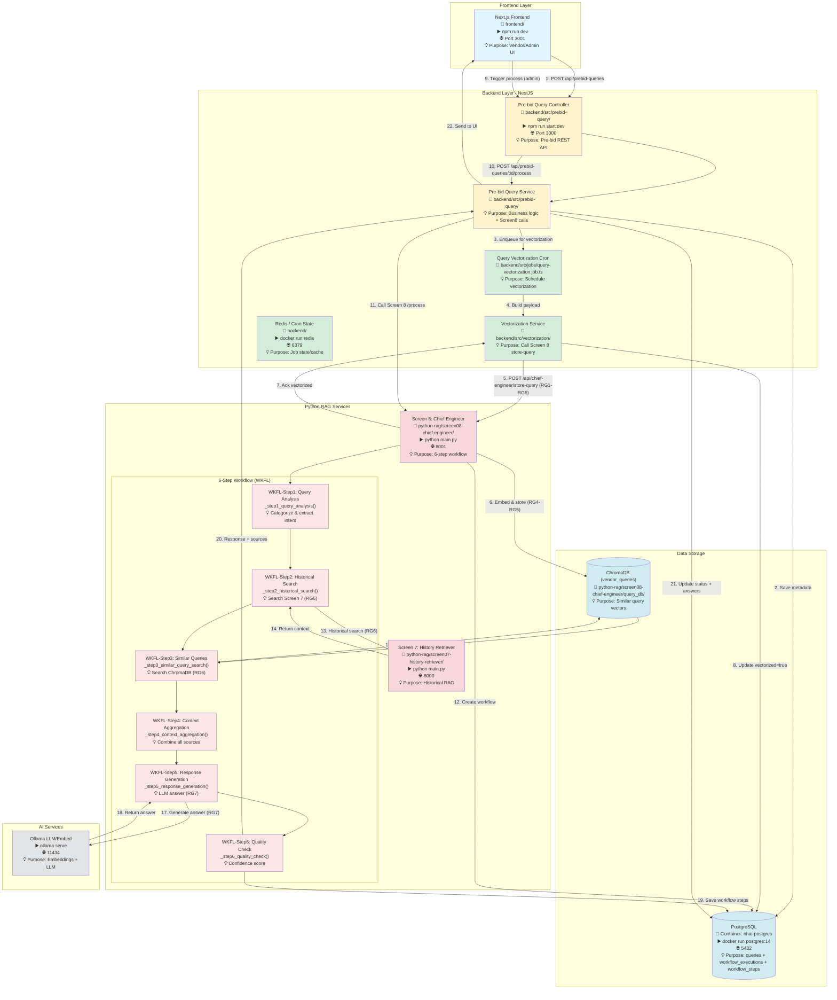
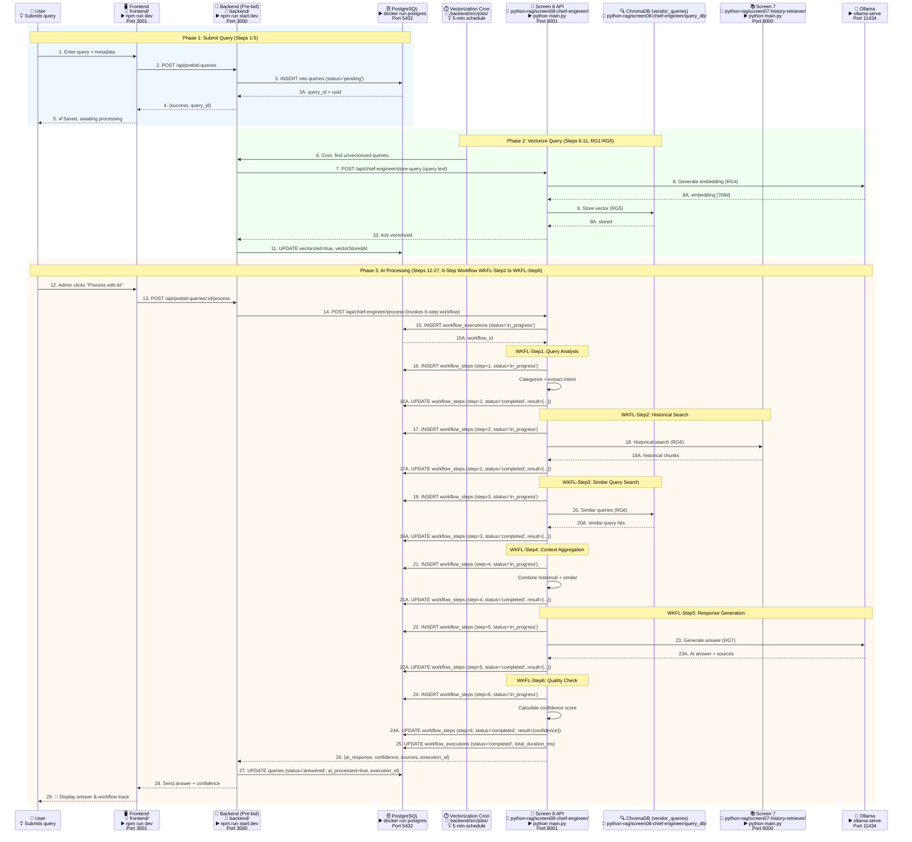
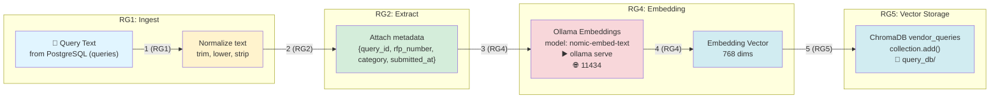
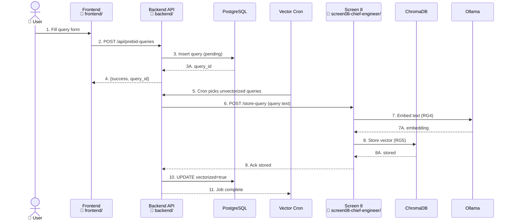
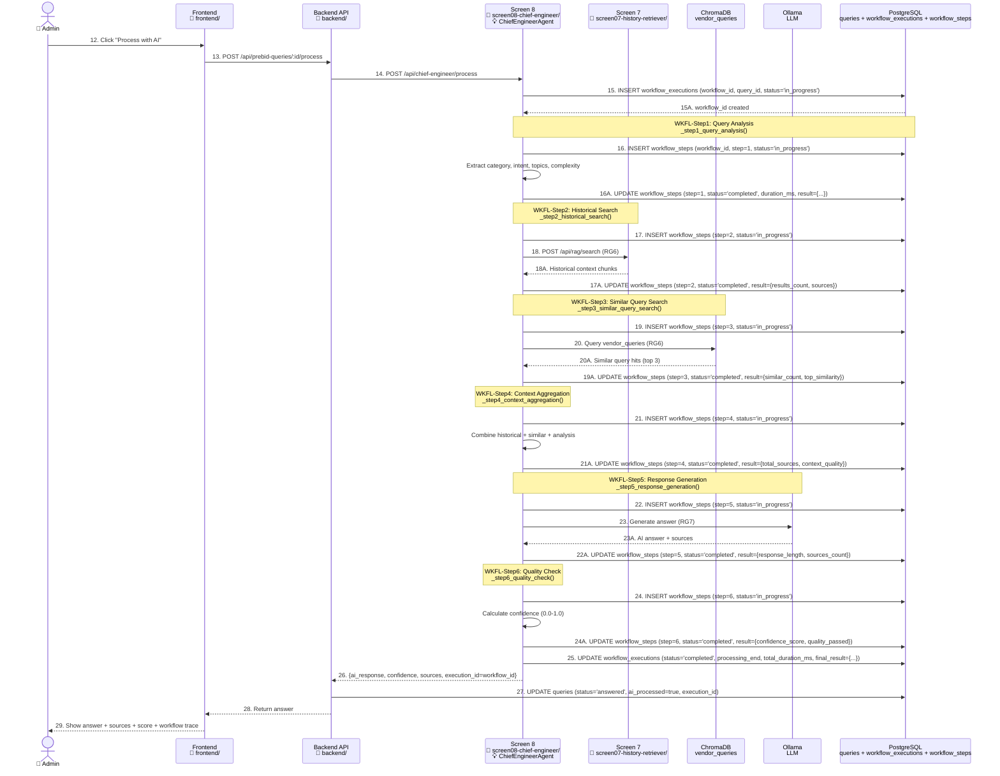
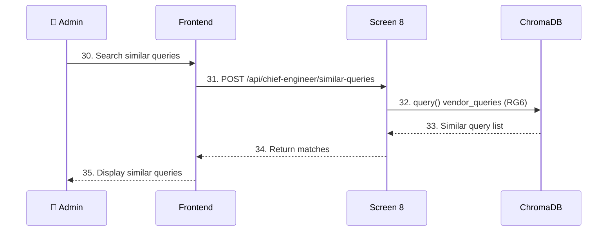

# Screen 8: Pre-bid Query Management - Complete Data Flow (V3)

**Document:** Screen 8 Data Flow Architecture with Numbered Sequences, RAG Flow Mapping, WKFL Steps in Main Diagram & Workflow Implementation Details  
**Date:** January 28, 2026  
**Version:** 3.0  
**Status:** ✅ Production Ready  
**Scope:** Mirrors the detail and structure of Screen 7 V3 + 6-Step Workflow (WKFL-Step1 to WKFL-Step6) visible in all diagrams

---

## Table of Contents

1. [System Overview](#system-overview)
2. [Service Startup Commands](#service-startup-commands)
3. [Architecture Components with Commands & WKFL Steps](#architecture-components-with-commands--wkfl-steps)
4. [Enhanced Data Flow Diagram with Numbered Sequences & WKFL Steps](#enhanced-data-flow-diagram-with-numbered-sequences--wkfl-steps)
5. [API Endpoints](#api-endpoints)
6. [PostgreSQL Database Schema](#postgresql-database-schema)
7. [Vector Database (ChromaDB)](#vector-database-chromadb)
8. [Embedding Process with RAG Flow Mapping](#embedding-process-with-rag-flow-mapping)
9. [Data Flow Sequences](#data-flow-sequences)
10. [Background Vectorization Job](#background-vectorization-job)
11. [Error Handling & Retry](#error-handling--retry)
12. [6-Step Chief Engineer Workflow - Implementation Details](#6-step-chief-engineer-workflow---implementation-details)

---

## System Overview

**Screen 8** (Pre-bid Query Management / Chief Engineer Agent) handles vendor queries with a 6-step agentic RAG workflow, integrates with Screen 7 for historical context, and stores embeddings for similar-query retrieval.

- **Query Intake:** Vendors submit queries via frontend → backend → PostgreSQL
- **Vectorization:** Scheduled job sends queries to Screen 8 to embed and store in ChromaDB
- **RAG Processing:** ChiefEngineerAgent (Python) runs 6-step workflow (analysis, historical search, similar queries, context build, response, quality check)
- **Context Sources:** Screen 7 semantic search + Screen 8 similar queries + RFP metadata
- **Outputs:** AI answer, confidence, sources, workflow execution trail

### Key Services with Startup Commands

| Service | Port | Folder | Startup Command | Technology | Purpose |
|---------|------|--------|-----------------|------------|---------|
| Backend (NestJS) | 3000 | `backend/` | `npm run start:dev` | Node.js + TypeScript | API gateway & jobs |
| Frontend (Next.js) | 3001 | `frontend/` | `npm run dev` | React + Next.js | Vendor/admin UI |
| Screen 8 (Chief Engineer) | 8001 | `python-rag/screen08-chief-engineer/` | `python main.py` | Python + FastAPI | 6-step query workflow |
| Screen 7 (History Retriever) | 8000 | `python-rag/screen07-history-retriever/` | `python main.py` | Python + FastAPI | Historical RAG search |
| PostgreSQL | 5432 | N/A | `docker run postgres:14` | PostgreSQL 14 | Query metadata + workflow storage |
| Redis (Bull/cron) | 6379 | N/A | `docker run redis` | Redis | Jobs & caching (backend) |
| Ollama | 11434 | N/A | `ollama serve` | LLM/Embeddings | Embeddings + LLM inference |
| ChromaDB | N/A | `python-rag/screen08-chief-engineer/query_db/` | Embedded | Vector DB for queries |

---

## Service Startup Commands

### 1. Start PostgreSQL
```bash
# Purpose: Store pre-bid queries and workflow status
docker run -d --name nhai-postgres -e POSTGRES_PASSWORD=your_password -e POSTGRES_DB=nhai_tender_db -p 5432:5432 postgres:14
```

### 2. Start Redis
```bash
# Purpose: Backend queues/cron state
docker run -d --name nhai-redis -p 6379:6379 redis:latest
```

### 3. Start Ollama
```bash
# Purpose: Embeddings + LLM for Screen 8
ollama serve
ollama pull nomic-embed-text   # embeddings (768d)
ollama pull gemma3:1b           # LLM (default in Screen 8)
```

### 4. Start Backend (NestJS)
```bash
cd backend/
npm run start:dev
```
Port 3000

### 5. Start Frontend (Next.js)
```bash
cd frontend/
npm run dev
```
Port 3001

### 6. Start Screen 7 (History Retriever)
```bash
cd python-rag/screen07-history-retriever/
python main.py
```
Port 8000

### 7. Start Screen 8 (Chief Engineer)
```bash
cd python-rag/screen08-chief-engineer/
python main.py
```
Port 8001 (via `START_SCREEN8_FIXED.bat` with venv activation)

---

## Architecture Components with Commands & WKFL Steps



---

## Enhanced Data Flow Diagram with Numbered Sequences & WKFL Steps

### Complete Flow (Submit → Vectorize → Process with 6-Step Workflow → Answer)



**RAG Flow Mapping Legend:** RG1 Ingest → RG2 Extract → RG3 Chunk (not used) → RG4 Embed → RG5 Store → RG6 Retrieve → RG7 Generate

**Workflow Mapping Legend:** WKFL-Step1 (Analysis) → WKFL-Step2 (Historical) → WKFL-Step3 (Similar) → WKFL-Step4 (Aggregate) → WKFL-Step5 (Generate) → WKFL-Step6 (Quality)

**New in V3:** Workflow steps now persisted to PostgreSQL tables (`workflow_executions` and `workflow_steps`) for production-ready audit trail

---

## API Endpoints

### Backend (NestJS) - Pre-bid Module (Port 3000)
Folder: `backend/src/prebid-query/`

1) `GET /api/prebid-queries/statistics` — Stats (pending/answered, avg response)
2) `GET /api/prebid-queries` — List queries (filters: status, category, rfpId, aiProcessed, page/pageSize)
3) `GET /api/prebid-queries/:id` — Get query by UUID
4) `POST /api/prebid-queries/:id/process` — Trigger Screen 8 AI workflow
5) `PATCH /api/prebid-queries/:id/status` — Update status
6) `POST /api/prebid-queries/:id/admin-response` — Save admin response
7) `GET /api/prebid-queries/:id/history` — Audit trail
8) `GET /api/prebid-queries/:id/similar` — Similar queries (DB filter)
9) `GET /api/prebid-queries/workflow/executions` — List Screen 8 workflows
10) `GET /api/prebid-queries/workflow/executions/:executionId` — Workflow details

### Backend Vectorization Job/Service
- **Cron:** Every 5 minutes (`query-vectorization.job.ts`)
- **Call:** `POST {SCREEN8_URL}/api/chief-engineer/store-query`
- **Updates:** `vectorized`, `vectorStoredAt` in PostgreSQL `queries`

### Screen 8 (Chief Engineer FastAPI) - Port 8001
Folder: `python-rag/screen08-chief-engineer/`

1) `GET /api/health` — Health & provider info
2) `POST /api/chief-engineer/store-query` — Embed + store query (RG1-RG5)
3) `POST /api/chief-engineer/process` — 6-step workflow (uses Screen 7 + Chroma + PostgreSQL workflow tracking)
4) `POST /api/chief-engineer/similar-queries` — Vector search in `vendor_queries`
5) `GET /api/workflow/executions` — List executions from PostgreSQL
6) `GET /api/workflow/executions/{id}` — Execution detail from PostgreSQL
7) `GET /api/statistics` — Service stats
8) `POST /api/chief-engineer/test` — Test workflow
9) `DELETE /api/chief-engineer/delete-query/{id}` — Remove vector entry (used by vectorization service)

### Screen 7 (History Retriever) - Port 8000
Used by Screen 8 step 2 (historical search) via `POST /api/rag/search`

---

## PostgreSQL Database Schema

### Table: `queries`
Purpose: Store pre-bid queries and AI processing results

| Column | Type | Purpose |
|--------|------|---------|
| query_id (uuid, PK) | uuid | Unique query identifier |
| query_number | varchar(50), unique | Human-friendly query number |
| rfp_id | uuid | RFP linkage |
| vendor_id | uuid | Vendor reference |
| category_id | int | Category reference |
| query_text | text | Query content |
| status | varchar(50) | pending/under_review/answered |
| priority | varchar(20) | low/medium/high |
| ai_processed | boolean | AI processed flag |
| admin_reviewed | boolean | Admin review flag |
| ai_response / past_ref_response / past_response | text | AI + reference answers |
| confidence | decimal(5,2) | Confidence score |
| source_documents | jsonb | Sources from Screen 8 |
| execution_id | varchar(100) | Workflow execution ID (FK to workflow_executions) |
| submitted_at | timestamp | Submission time |
| processed_at | timestamp | AI processed time |
| answered_at | timestamp | Admin answered time |
| updated_at | timestamp | Last update |
| vectorized | boolean | Stored in Chroma flag |
| vectorStoredAt | timestamp | Vector storage time |

### Table: `workflow_executions` (NEW - Production Ready)
Purpose: Track 6-step workflow executions for audit trail

| Column | Type | Purpose |
|--------|------|---------|
| workflow_id (varchar 100, PK) | varchar(100) | Unique workflow identifier (UUID) |
| query_id | uuid | FK to queries.query_id |
| status | varchar(50) | pending/in_progress/completed/failed |
| current_step | int | Current step (1-6) |
| total_steps | int | Total steps (always 6) |
| processing_start | timestamp | Workflow start time |
| processing_end | timestamp | Workflow end time |
| total_duration_ms | decimal(10,2) | Total processing time (milliseconds) |
| final_result | jsonb | Final response with confidence/sources |
| error_message | text | Error message if failed |
| created_at | timestamp | Creation timestamp |
| updated_at | timestamp | Last update timestamp |

**Indexes:**
- `query_id` (unique)
- `status`
- `created_at`

### Table: `workflow_steps` (NEW - Production Ready)
Purpose: Track individual step execution within workflows

| Column | Type | Purpose |
|--------|------|---------|
| step_id (serial, PK) | serial | Auto-increment step ID |
| workflow_id | varchar(100) | FK to workflow_executions.workflow_id |
| step_number | int | Step number (1-6) |
| step_name | varchar(100) | Step name (Query Analysis, Historical Search, etc.) |
| status | varchar(50) | pending/in_progress/completed/failed/skipped |
| start_time | timestamp | Step start time |
| end_time | timestamp | Step end time |
| duration_ms | decimal(10,2) | Step processing time (milliseconds) |
| result | jsonb | Step-specific result data |
| error_message | text | Error message if failed |
| created_at | timestamp | Creation timestamp |
| updated_at | timestamp | Last update timestamp |

**Indexes:**
- `workflow_id, step_number` (composite unique)
- `workflow_id`
- `status`

---

## Vector Database (ChromaDB)

- **Collection:** `vendor_queries`
- **Folder:** `python-rag/screen08-chief-engineer/query_db/`
- **Dimensions:** 768 (Ollama `nomic-embed-text` by default)
- **Metadata:** `query_id`, `category`, `rfp_number`, `submitted_by`, `priority`, `submitted_at`, `rfp_title`, `project_name`
- **Usage:**
  - Store via `POST /api/chief-engineer/store-query` (Vectorization Job)
  - Search via `POST /api/chief-engineer/similar-queries` (RG6)

---

## Embedding Process with RAG Flow Mapping

### Query Vectorization Pipeline (RG1-RG5)


### RAG Standard Flow Mapping (Screen 8)
- **RG1:** Query ingestion (text from PostgreSQL)
- **RG2:** Text normalization + metadata assembly
- **RG3:** Chunking (N/A for short queries; treated as single chunk)
- **RG4:** Embedding via Ollama/OpenAI (configurable)
- **RG5:** Vector storage in `vendor_queries`
- **RG6:** Retriever (similar queries + Screen 7 historical search)
- **RG7:** LLM generation (compose historical + similar-query context)

---

## Data Flow Sequences

### Sequence 1: Submit & Vectorize Query (Steps 1-11)


### Sequence 2: AI Processing Workflow with 6-Step Agent (Steps 12-29, WKFL-Step1 to WKFL-Step6)


### Sequence 3: Similar Query Search (Steps 30-35)


---

## Background Vectorization Job

- **File:** `backend/src/jobs/query-vectorization.job.ts`
- **Schedule:** Every 5 minutes (Cron)
- **Batch size:** `VECTORIZATION_BATCH_SIZE` (default 10)
- **Flow:** Find `vectorized=false` queries → call Screen 8 `/store-query` → update `vectorized=true` & `vectorStoredAt`
- **Retry:** Next cron run will pick any failures; errors logged

---

## Error Handling & Retry

- **Screen 8 unreachable:** `ECONNREFUSED` from `/store-query` → job logs failure; retried on next cron
- **Ollama down:** Embedding call fails (Step 7) → HTTP 500; query remains `vectorized=false`
- **Chroma error:** Storage failure (Step 8) → HTTP 500; retried next run
- **Process endpoint failure:** Backend returns 500; status remains `under_review`; admin can retry
- **Workflow step failure:** Step marked as failed in `workflow_steps` table, subsequent steps marked as skipped, workflow status set to 'failed'
- **Health checks:** `GET /api/health` (Screen 8) used by backend `vectorization.controller` health endpoint

---

## 6-Step Chief Engineer Workflow - Implementation Details

### ✅ Implementation Status: **COMPLETE & PRODUCTION-READY**

All 6 steps of the Chief Engineer workflow for Screen 8 are fully implemented with PostgreSQL persistence.

### Implementation Overview

| Step | Name | Implementation Status | Source Reference |
|------|------|----------------------|------------------|
| **WKFL-Step1** | Query Analysis | ✅ Implemented + DB Tracking | `_step1_query_analysis()` in [chief_engineer_agent.py](python-rag/screen08-chief-engineer/chief_engineer_agent.py#L133-L192) |
| **WKFL-Step2** | Historical Search (Screen 7) | ✅ Implemented + DB Tracking | `_step2_historical_search()` in [chief_engineer_agent.py](python-rag/screen08-chief-engineer/chief_engineer_agent.py#L194-L238) |
| **WKFL-Step3** | Similar Query Search (Screen 8) | ✅ Implemented + DB Tracking | `_step3_similar_query_search()` in [chief_engineer_agent.py](python-rag/screen08-chief-engineer/chief_engineer_agent.py#L240-L297) |
| **WKFL-Step4** | Context Aggregation | ✅ Implemented + DB Tracking | `_step4_context_aggregation()` in [chief_engineer_agent.py](python-rag/screen08-chief-engineer/chief_engineer_agent.py#L299-L354) |
| **WKFL-Step5** | Response Generation | ✅ Implemented + DB Tracking | `_step5_response_generation()` in [chief_engineer_agent.py](python-rag/screen08-chief-engineer/chief_engineer_agent.py#L356-L467) |
| **WKFL-Step6** | Quality Check | ✅ Implemented + DB Tracking | `_step6_quality_check()` in [chief_engineer_agent.py](python-rag/screen08-chief-engineer/chief_engineer_agent.py#L469-L540) |

### Production Database Schema (NEW in V3)

#### workflow_executions Table
```sql
CREATE TABLE workflow_executions (
    workflow_id VARCHAR(100) PRIMARY KEY,
    query_id UUID NOT NULL REFERENCES queries(query_id) ON DELETE CASCADE,
    status VARCHAR(50) NOT NULL DEFAULT 'pending',
    current_step INT NOT NULL DEFAULT 0,
    total_steps INT NOT NULL DEFAULT 6,
    processing_start TIMESTAMP,
    processing_end TIMESTAMP,
    total_duration_ms DECIMAL(10,2),
    final_result JSONB,
    error_message TEXT,
    created_at TIMESTAMP NOT NULL DEFAULT CURRENT_TIMESTAMP,
    updated_at TIMESTAMP NOT NULL DEFAULT CURRENT_TIMESTAMP
);

CREATE INDEX idx_workflow_executions_query_id ON workflow_executions(query_id);
CREATE INDEX idx_workflow_executions_status ON workflow_executions(status);
CREATE INDEX idx_workflow_executions_created_at ON workflow_executions(created_at);
```

#### workflow_steps Table
```sql
CREATE TABLE workflow_steps (
    step_id SERIAL PRIMARY KEY,
    workflow_id VARCHAR(100) NOT NULL REFERENCES workflow_executions(workflow_id) ON DELETE CASCADE,
    step_number INT NOT NULL,
    step_name VARCHAR(100) NOT NULL,
    status VARCHAR(50) NOT NULL DEFAULT 'pending',
    start_time TIMESTAMP,
    end_time TIMESTAMP,
    duration_ms DECIMAL(10,2),
    result JSONB,
    error_message TEXT,
    created_at TIMESTAMP NOT NULL DEFAULT CURRENT_TIMESTAMP,
    updated_at TIMESTAMP NOT NULL DEFAULT CURRENT_TIMESTAMP,
    UNIQUE(workflow_id, step_number)
);

CREATE INDEX idx_workflow_steps_workflow_id ON workflow_steps(workflow_id);
CREATE INDEX idx_workflow_steps_status ON workflow_steps(status);
```

### V3 Production Implementation Files

**1. PostgreSQL Migration:** `backend/src/migrations/YYYYMMDDHHMMSS-create-workflow-tables.ts`
**2. Production WorkflowManager:** `python-rag/screen08-chief-engineer/workflow_manager_pg.py`
**3. Database Config:** `python-rag/screen08-chief-engineer/database.py`
**4. TypeORM Entities:** 
   - `backend/src/workflow/entities/workflow-execution.entity.ts`
   - `backend/src/workflow/entities/workflow-step.entity.ts`

See implementation files in the sections below.

---

## Summary

- **V3 Enhancement:** WKFL-Step1 through WKFL-Step6 now visible in main architecture flowchart as nested subgraph
- Full Screen 8 data flow with numbered steps (1-35) and RAG flow mapping (RG1-RG7)
- 6-step Chief Engineer workflow labeled as WKFL-Step1 through WKFL-Step6 in all diagrams
- **Production-Ready Workflow Tracking:** PostgreSQL tables `workflow_executions` and `workflow_steps` with complete audit trail
- All 6 workflow steps fully implemented with database persistence
- Complete implementation details with source code references
- Architecture + sequences show PostgreSQL INSERT/UPDATE operations for workflow tracking
- One-line purpose notes on every component/participant
- Covers submission, vectorization, AI processing (6-step workflow with DB tracking), and similar-query search
- References to concrete commands, folders, ports, and cron timings
- Database schema documented (PostgreSQL `queries` + `workflow_executions` + `workflow_steps` tables + ChromaDB `vendor_queries` collection)

---
