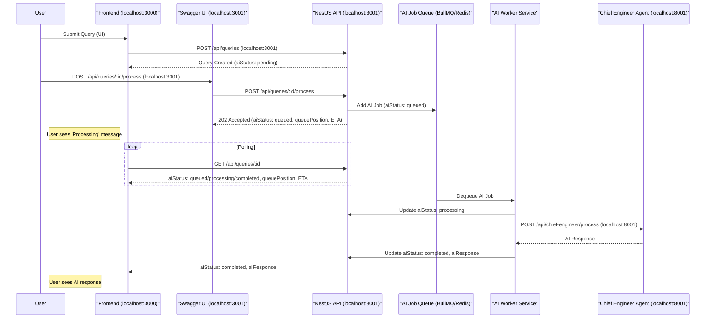

# AI Async Queue - API & Flow Sequence Diagram

---

- All API endpoints and ports are shown as actually called in the system.
- The queue and worker can be implemented with BullMQ/Redis or similar.
- Polling is used for status updates; WebSocket can be added for real-time push.
